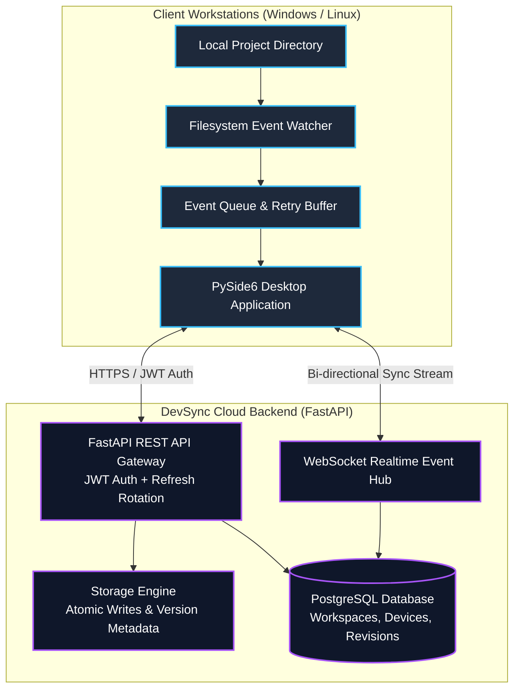

# 🔄 DevSync // Developer Workspace Cloud-Desktop Synchronization

[](https://www.python.org/)
[](https://fastapi.tiangolo.com/)
[-41CD52?style=flat-square&logo=qt)](https://www.qt.io/)
[](https://www.postgresql.org/)
[](#public-beta-status)
[](LICENSE)

> A distributed developer workspace synchronization platform featuring a high-performance **FastAPI cloud backend** and an intuitive **PySide6 (Qt) desktop client** for real-time project file synchronization across trusted workstations.

> [!NOTE]
> **Development Note:** This repository was published after the initial development phase. The GitHub commit history therefore does not represent the complete development timeline.

---

### 🖥️ Synchronization Flow Preview

```text
┌────────────────────────────────────────────────────────────────────────┐
│  [Desktop Client: Workstation-Alpha]                                    │
│  [WATCHER] Detected file change: 'src/api/auth.py' (SHA256: e3b0c44...) │
│  [CLIENT] Packaging event -> Generating diff -> Uploading to cloud     │
│                                                                        │
│  [Cloud Backend: FastAPI Relay]                                        │
│  [EVENT] Workspace #104: Revision bumped v12 -> v13                    │
│  [RELAY] WebSocket broadcasting update to 2 connected trusted devices  │
│                                                                        │
│  [Desktop Client: Workstation-Beta]                                     │
│  [WS-EVENT] Incoming file version: 'src/api/auth.py'                   │
│  [SYNC] Validated checksum -> Atomic write complete (0 conflicts)      │
└────────────────────────────────────────────────────────────────────────┘
```

---

### 🏗️ System Architecture



---

### ✨ Core Capabilities

- **JWT Authentication with Refresh Rotation:** Secure user signup, login, and silent refresh token rotation across long-running desktop sessions.
- **Ordered Sync Event Protocol:** Event-driven synchronizer ensuring consistency across file updates, renames, soft deletes, and folder migrations.
- **WebSocket Realtime Updates:** Instant push notifications to trusted clients to trigger delta downloads the moment changes are committed on another machine.
- **Local Storage Provider & Version Tracking:** Comprehensive file revisioning with conflict-copy generation whenever concurrent modifications occur.
- **PySide6 Native Desktop App:** System tray minimization, visual sync progress indicators, conflict inspection, and device connection status.
- **Production-Ready Containerization:** Docker Compose setup with health checks, database auto-migration via Alembic, and preconfigured networking.

---

### ⚡ Quick Start

#### 1. Clone & Configure Environment
```powershell
git clone https://github.com/Krishagarwal558/Devsync.git
cd Devsync
Copy-Item server\.env.example server\.env
```

#### 2. Launch Local PostgreSQL & Backend
```powershell
docker compose -f docker-compose.alpha.yml --env-file server\.env up --build
```

#### 3. Run Database Migrations & Verify
```powershell
docker compose -f docker-compose.alpha.yml exec backend alembic -c server/alembic.ini upgrade head
Invoke-RestMethod http://127.0.0.1:8000/health
```

#### 4. Launch Desktop Client
```powershell
python -m desktop.app.main
```

---

### 🌐 Cloud Deployment Guides

Detailed architecture and infrastructure walk-throughs for production hosting:

- 📘 [Public Beta Guide](docs/PUBLIC_BETA_GUIDE.md) — Operational architecture and checklist
- 🚀 [Google Cloud Run Deployment](docs/CLOUD_RUN_DEPLOYMENT_GUIDE.md) — Serverless container deployment
- 📦 [Cloudflare R2 Storage Guide](docs/R2_SETUP_GUIDE.md) — S3-compatible zero-egress object storage
- 🟣 [Render Deployment Guide](docs/RENDER_DEPLOYMENT_GUIDE.md) — Managed backend web service
- 🐘 [Neon PostgreSQL Setup](docs/NEON_POSTGRES_SETUP.md) — Serverless Postgres scaling
- 🛡️ [Security Notes](docs/SECURITY_NOTES.md) — Token policies, CORS, and credential handling

---

### 🧪 Test Suite & Release Verification

```powershell
# Run compiler check and unit tests
python -m compileall desktop server tests scripts
python -m pytest tests -q

# Execute two-folder sync reliability smoke test
python scripts\two_folder_reliability_smoke.py
python scripts\public_beta_check.py
```

### 📦 Build Windows Desktop Executable

```powershell
powershell -ExecutionPolicy Bypass -File scripts\build_windows_exe.ps1 -Python python
```

---

### 📁 Repository Structure

```text
├── server/               # FastAPI backend, routers, auth & WebSocket relays
│   ├── alembic/          # Database migrations
│   └── storage/          # Local file storage layer
├── desktop/app/          # PySide6 native desktop GUI & filesystem listener
├── docs/                 # Production deployment and operational guides
├── scripts/              # Packaging, reliability smoke tests & release scripts
└── tests/                # Automated pytest suite
```

---

### 📄 License

This project is licensed under the MIT License — see the [LICENSE](LICENSE) file for details.
