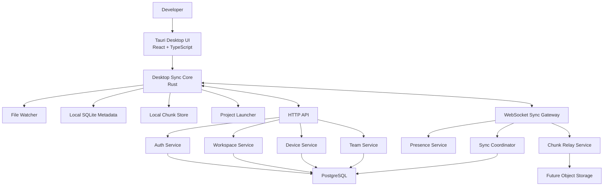
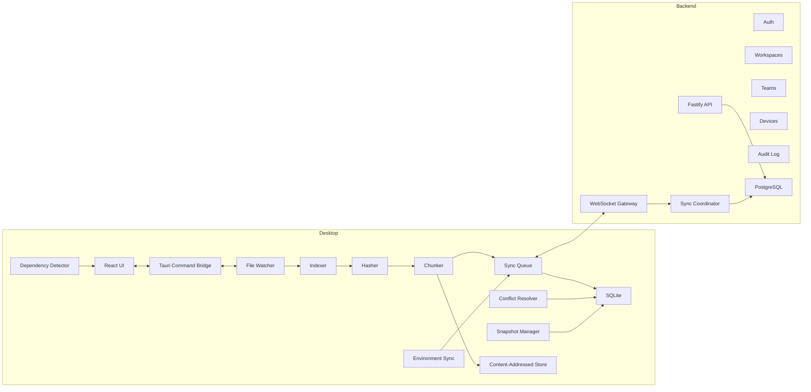

# DevSync Software Architecture

Working title: **DevSync**  
Tagline: **Your development workspace follows you everywhere.**

## 1. Overall Architecture

DevSync is a local-first desktop synchronization platform for software development workspaces. It does not treat projects as generic folders. It models the workspace as a continuously changing development environment made of files, dependencies, editor configuration, runtime metadata, snapshots, devices, users, and permissions.

The system has four primary layers:

| Layer | Purpose | Main Technologies | Why This Design |
|---|---|---|---|
| Desktop App | User interface, local indexing, file watching, sync engine, launch orchestration | React, TypeScript, Tauri, Rust, SQLite | Keeps work usable offline and makes synchronization feel instant |
| Local Sync Core | Detects filesystem changes, chunks content, stores metadata, resolves conflicts, queues sync operations | Rust, SQLite, file watchers, content-addressed storage | Rust gives reliable filesystem performance and memory safety |
| Backend Control Plane | Authentication, workspaces, teams, permissions, device registry, sync coordination, relay, audit logs | Node.js, Fastify, PostgreSQL, WebSockets | Fast product iteration with strong ecosystem support |
| Storage Plane | Chunk/object persistence, deduplication, snapshots, future cloud object storage | Local disk first, later S3-compatible object storage | Allows MVP without cloud lock-in while supporting scale later |

Core architectural choice: **local-first metadata and content-addressed file chunks**. Every device maintains a local workspace state in SQLite, a local content store, and a sync queue. The backend coordinates workspace membership, device trust, remote manifests, presence, and relay transfer, but the desktop can continue operating offline.

## 2. High-Level System Diagram



## 3. Component Diagram



## 4. Desktop Architecture

The desktop application is split between a React interface and a Rust engine exposed through Tauri commands and events.

| Module | Purpose | Responsibilities | Communication | Data Flow | Technology | Why Chosen |
|---|---|---|---|---|---|---|
| React UI | Human-facing workspace control center | Workspace list, sync status, conflicts, launch actions, team/device screens | Calls Tauri commands and receives app events | User action to command, engine event to UI state | React, TypeScript | Fast UI iteration and strong desktop frontend ecosystem |
| Tauri Bridge | Secure boundary between UI and native engine | Expose approved commands, emit events, validate payloads | React over Tauri IPC, Rust internal services | UI request to Rust service, result back to UI | Tauri | Smaller and safer than a full browser shell |
| Workspace Manager | Owns local workspace lifecycle | Create, join, archive, delete, template application, multi-project mapping | Calls SQLite, sync queue, backend API | Workspace metadata to local DB and backend | Rust | Central authority for workspace state |
| File Watcher | Watches project paths continuously | Detect create, modify, delete, rename, chmod where supported | Emits raw filesystem events to indexer | Filesystem event to normalized change event | Rust notify-style watcher | Native performance and cross-platform support |
| Indexer | Converts raw file events into workspace changes | Apply `.syncignore`, stat files, detect project boundaries, schedule hash work | Consumes watcher events, writes metadata | Raw event to indexed file record | Rust, SQLite | Prevents noisy filesystem events from corrupting sync state |
| Hasher | Produces identity and integrity hashes | File hash, chunk hash, manifest hash, verification | Indexer and chunker | File bytes to hash records | BLAKE3 or SHA-256 policy | Fast verification and deduplication |
| Chunker | Splits file content into reusable chunks | Fixed or content-defined chunking, compression, dedup lookup | Reads files, writes CAS, queues manifests | File to chunk list to manifest | Rust | Efficient large-file and delta transfer |
| Local Content Store | Stores content-addressed chunks | Persist chunks, verify hashes, garbage collect unreferenced chunks | Chunker, snapshotter, restore flow | Chunk hash to local blob path | Local filesystem | Simple, fast, offline-capable |
| Sync Queue | Durable outgoing and incoming operation log | Retry, backoff, ordering, dependency tracking, offline replay | SQLite, WebSocket, HTTP | Local change to queued operation to remote ack | Rust, SQLite | Survives app restarts and network loss |
| Sync Engine | Applies remote and local changes | Compare manifests, request missing chunks, apply patches, update clocks | Queue, resolver, backend gateway | Remote event to local mutation | Rust | Needs correctness, speed, and careful filesystem handling |
| Conflict Resolver | Detects and resolves divergent edits | Auto merge safe text changes, manual merge, keep mine/theirs, conflict files | Sync engine, UI, local DB | Divergent versions to resolution event | Rust plus diff engine | Keeps workspace usable under concurrent edits |
| Snapshot Manager | Captures restorable workspace states | Periodic and event-based snapshots, restore, deleted file recovery | Local DB, CAS, UI | Manifest to snapshot record | Rust, SQLite, CAS | Enables undo and disaster recovery |
| Dependency Detector | Detects dependency manifests | Detect package.json, Cargo.toml, requirements.txt, pyproject.toml, build.gradle, pom.xml | Indexer, UI, launcher | Manifest change to dependency status | Rust parsers where possible | Dev-specific value beyond generic sync |
| Environment Sync | Syncs editor and workspace settings | VS Code settings, extensions, launch configs, tasks, terminal profiles | File watcher, queue, UI | Settings files to environment metadata | Rust, JSON/TOML parsing | Makes the workspace actually portable |
| Project Launcher | One-click resume workflow | Sync, verify dependencies, install missing packages with approval, launch services, open browser | UI, dependency detector, process runner | Workspace state to launch plan | Rust process management | Turns sync into a complete developer workflow |

## 5. Backend Architecture

The backend is a control plane first and a content relay second. It should not be the sole source of truth for a developer's local work, but it is authoritative for identity, workspace membership, permissions, trusted devices, audit history, and remote manifests.

| Module | Purpose | Responsibilities | Communication | Data Flow | Technology | Why Chosen |
|---|---|---|---|---|---|---|
| API Gateway | Public HTTP API | Routing, validation, auth middleware, rate limits | Desktop app and web admin clients | HTTP request to service handler | Fastify, TypeScript | High performance with low framework overhead |
| Auth Service | User identity and sessions | Login, refresh tokens, device-scoped credentials, recovery flows | API, PostgreSQL | Credentials to session and device token | Fastify, PostgreSQL | Central security boundary |
| Workspace Service | Workspace lifecycle | Create, join, archive, delete, templates, storage metadata | API, sync coordinator | Workspace request to database mutation | Node.js, PostgreSQL | Product domain logic lives server-side |
| Team Service | Collaboration model | Invites, roles, permissions, active members | API, presence service | Membership change to permission records | Node.js, PostgreSQL | Keeps team policy consistent |
| Device Service | Trusted device registry | Pairing, authorization, revocation, last sync, device keys | API, auth, WebSocket gateway | Device challenge to trusted device record | Node.js, PostgreSQL | Device trust is separate from user login |
| Sync Coordinator | Remote sync authority | Workspace vector clocks, remote manifests, operation ordering, ack tracking | WebSocket gateway, PostgreSQL, relay | Client operation to canonical sync event | Node.js, PostgreSQL | Coordinates multi-device state without storing whole folders |
| WebSocket Gateway | Real-time transport | Sync events, presence, heartbeats, reconnect, resumable sessions | Desktop sync engine | Bidirectional event stream | WebSockets | Low-latency collaboration and status |
| Relay Service | Transfers chunks when direct sync is unavailable | Chunk upload/download tickets, integrity checks, future object-storage handoff | Sync engine, object storage | Chunk hash to temporary relay transfer | Node.js streams | Efficient and horizontally scalable |
| Presence Service | Live collaboration state | Active users, devices online, current project, typing/edit hints later | WebSocket gateway, PostgreSQL/Redis later | Connection state to presence event | In-memory MVP, Redis future | Presence is ephemeral and high-churn |
| Audit Service | Security and compliance trail | Workspace actions, device changes, role changes, sync anomalies | API, sync, auth | Domain event to audit row | PostgreSQL | Needed for teams and enterprise trust |

## 6. Networking Architecture

DevSync uses HTTP for request/response operations and WebSockets for long-lived real-time synchronization.

| Channel | Used For | Reliability Strategy |
|---|---|---|
| HTTP API | Login, workspace management, invites, device pairing, chunk ticket negotiation | Idempotency keys, request retries, pagination |
| WebSocket | Sync events, presence, heartbeats, live device status | Session resume token, sequence numbers, ack/replay |
| LAN Sync | Future direct device transfer on same network | mDNS discovery, mutual device verification, encrypted peer channel |
| Relay Sync | Internet synchronization through backend | Chunk tickets, hash verification, resumable upload/download |
| Offline Queue | Local-first operation persistence | SQLite queue with retry state and dependency ordering |

Networking rules:

1. Every sync event has a workspace id, device id, operation id, parent state reference, monotonic sequence, and idempotency key.
2. Clients acknowledge applied remote events.
3. Server can replay missed events from the last acknowledged sequence.
4. Chunk transfer is separate from metadata synchronization.
5. Metadata is small and real-time; content chunks may stream or resume independently.

## 7. PostgreSQL Database Schema

Core production schema:

| Table | Key Fields | Purpose |
|---|---|---|
| users | id, email, name, password_hash or provider_id, created_at | User identity |
| sessions | id, user_id, refresh_token_hash, expires_at, device_id | Session lifecycle |
| workspaces | id, owner_user_id, name, slug, status, encryption_mode, created_at, archived_at | Workspace records |
| workspace_members | workspace_id, user_id, role_id, status, joined_at | Membership |
| roles | id, workspace_id nullable, name, scope | Built-in and custom roles |
| permissions | id, role_id, action, resource | Role permissions |
| invites | id, workspace_id, email, role_id, token_hash, expires_at, accepted_at | Team invitations |
| devices | id, user_id, name, platform, public_key, trust_status, last_seen_at | Registered devices |
| workspace_devices | workspace_id, device_id, authorized_at, revoked_at | Workspace-level device access |
| projects | id, workspace_id, name, root_path_alias, status | Multiple projects per workspace |
| remote_manifests | id, workspace_id, manifest_hash, parent_manifest_hash, created_by_device_id, sequence | Remote workspace state |
| file_entries | id, workspace_id, path, file_type, size, mode, content_hash, deleted_at | Latest known file index |
| file_versions | id, workspace_id, path, content_hash, manifest_hash, author_device_id, created_at | File history |
| chunks | hash, size, compressed_size, storage_status, ref_count | Deduplicated chunk catalog |
| file_chunks | file_version_id, chunk_hash, ordinal, offset, length | File-to-chunk mapping |
| sync_operations | id, workspace_id, device_id, operation_type, status, sequence, created_at | Operation history and replay |
| snapshots | id, workspace_id, manifest_hash, label, created_by, created_at | Restorable states |
| conflicts | id, workspace_id, path, base_hash, local_hash, remote_hash, status | Conflict records |
| audit_logs | id, workspace_id, actor_user_id, device_id, action, metadata, created_at | Security and activity trail |
| dependency_manifests | id, workspace_id, project_id, path, ecosystem, content_hash | Dependency tracking |
| environment_profiles | id, workspace_id, project_id, editor, profile_hash, updated_at | Editor/environment sync |

Scale notes:

1. Partition high-volume tables such as `sync_operations`, `file_versions`, and `audit_logs` by workspace id or time.
2. Store chunk bytes outside PostgreSQL in production object storage.
3. Keep PostgreSQL authoritative for metadata and integrity, not large binary payloads.

## 8. Local SQLite Schema

Each device stores a local workspace database.

| Table | Key Fields | Purpose |
|---|---|---|
| local_workspaces | id, remote_workspace_id, local_path, status, last_opened_at | Local workspace registration |
| local_projects | id, workspace_id, name, root_path | Local project paths |
| local_files | workspace_id, path, file_type, size, mtime, mode, content_hash, dirty_status | Current local index |
| local_file_versions | id, workspace_id, path, content_hash, manifest_hash, created_at | Local history |
| local_chunks | hash, size, compressed_size, local_path, verified_at, ref_count | Local CAS index |
| local_file_chunks | file_version_id, chunk_hash, ordinal, offset, length | Chunk mapping |
| sync_queue | id, workspace_id, operation_type, payload_ref, status, attempts, next_retry_at | Durable queue |
| remote_events | id, workspace_id, remote_sequence, operation_id, applied_at | Replay and idempotency |
| snapshots | id, workspace_id, manifest_hash, label, created_at | Local restore points |
| conflicts | id, workspace_id, path, base_hash, local_hash, remote_hash, status | Conflict UI source |
| ignored_paths | workspace_id, pattern, source | `.syncignore` and defaults |
| dependency_state | workspace_id, project_id, manifest_path, ecosystem, installed_state | Dependency sync |
| environment_state | workspace_id, project_id, key, value_hash, source_path | Editor/workspace config |
| device_state | workspace_id, device_id, last_seen_at, last_sync_sequence | Team/device status cache |

SQLite is chosen because it is embedded, transactional, durable, and appropriate for local-first metadata. It avoids requiring a local database service.

## 9. Repository Folder Structure

Recommended monorepo:

```text
devsync/
  apps/
    desktop/
    server/
    marketing/
  crates/
    sync-core/
    file-watcher/
    chunk-store/
    conflict-resolution/
    launcher/
    env-sync/
  packages/
    shared-types/
    api-contracts/
    protocol/
  docs/
    architecture/
    security/
    sync-protocol/
  infra/
    docker/
    migrations/
    terraform/
  tests/
    fixtures/
    integration/
    e2e/
```

This separates product apps, reusable Rust crates, shared TypeScript contracts, docs, infrastructure, and test fixtures.

## 10. Rust Modules

```text
apps/desktop/src-tauri/src/
  main
  commands/
  app_state/
  workspace/
  watcher/
  indexer/
  hashing/
  chunking/
  content_store/
  sync_queue/
  sync_engine/
  conflict/
  snapshot/
  dependencies/
  environment/
  launcher/
  security/
  networking/
  telemetry/
```

| Module | Purpose and Responsibilities |
|---|---|
| commands | Tauri IPC commands exposed to React |
| app_state | Shared runtime state, handles, and service registry |
| workspace | Create, join, archive, delete, template handling |
| watcher | Cross-platform filesystem watching and event normalization |
| indexer | Ignore rules, metadata extraction, dirty-state calculation |
| hashing | File, chunk, and manifest hashing |
| chunking | Chunk boundaries, compression, deduplication |
| content_store | Local CAS layout, verification, garbage collection |
| sync_queue | Durable operation queue, retries, backoff |
| sync_engine | Metadata exchange, chunk negotiation, apply remote changes |
| conflict | Conflict detection, merge strategy, resolution records |
| snapshot | Snapshot creation, restore, deleted file recovery |
| dependencies | Dependency manifest detection and install recommendations |
| environment | VS Code and workspace setting synchronization |
| launcher | Project startup orchestration |
| security | Encryption, key storage, device credentials |
| networking | HTTP/WebSocket clients, reconnect, heartbeat |
| telemetry | Local diagnostics and privacy-safe metrics |

## 11. React Folder Structure

```text
apps/desktop/src/
  app/
  routes/
  components/
  features/
    workspaces/
    team/
    devices/
    sync/
    conflicts/
    history/
    dependencies/
    environment/
    launcher/
    settings/
  hooks/
  stores/
  services/
  styles/
  types/
```

| Area | Purpose |
|---|---|
| app | Application shell, providers, routing bootstrap |
| routes | Screen-level composition |
| components | Reusable UI primitives |
| features | Domain-specific UI modules |
| hooks | Tauri event subscriptions and UI helpers |
| stores | Client state, cached sync status, optimistic updates |
| services | Typed wrappers around Tauri commands |
| types | Shared UI and protocol types |

React stays mostly presentation-focused. The Rust engine owns sync correctness.

## 12. Backend Folder Structure

```text
apps/server/src/
  main
  config/
  plugins/
  modules/
    auth/
    users/
    workspaces/
    teams/
    devices/
    sync/
    relay/
    presence/
    audit/
    billing-future/
  db/
    migrations/
    repositories/
  protocol/
  security/
  observability/
  jobs/
```

| Area | Purpose |
|---|---|
| modules | Business capabilities with routes, services, repositories |
| db | Migrations and persistence adapters |
| protocol | Shared validation for HTTP and WebSocket payloads |
| security | Token, key, rate-limit, and permission helpers |
| observability | Logs, metrics, traces |
| jobs | Cleanup, retention, snapshot compaction, email |

## 13. API Design

HTTP APIs should be versioned under `/v1`.

| Endpoint Group | Example Operations | Purpose |
|---|---|---|
| Auth | register, login, refresh, logout | User/session lifecycle |
| Workspaces | create, list, join, archive, delete, templates | Workspace lifecycle |
| Members | invite, accept, remove, change role | Team management |
| Devices | pair, approve, revoke, list | Trusted devices |
| Projects | create, list, update, archive | Multi-project support |
| Sync | get manifest, submit operation, request replay | Sync metadata fallback |
| Chunks | request upload ticket, request download ticket, verify | Chunk transfer negotiation |
| Snapshots | create, list, restore metadata | Version history |
| Conflicts | list, mark resolved | Conflict tracking |
| Audit | list events | Team security history |

API principles:

1. All mutating requests use idempotency keys.
2. Workspace access is checked on every request.
3. Device authorization is separate from user authentication.
4. Large payloads use streaming or object-storage tickets, not JSON bodies.
5. API contracts are shared between desktop and server through typed packages.

## 14. WebSocket Events

WebSocket sessions are authenticated with a short-lived access token and a trusted device id.

| Event | Direction | Purpose |
|---|---|---|
| connection.hello | Client to server | Start session with device/workspace context |
| connection.ready | Server to client | Confirm session and resume point |
| heartbeat.ping / heartbeat.pong | Both | Liveness |
| presence.user_online | Server to clients | User/device active state |
| presence.user_offline | Server to clients | User/device inactive state |
| sync.operation_created | Client to server | Submit local metadata operation |
| sync.operation_accepted | Server to client | Ack operation and assign sequence |
| sync.operation_rejected | Server to client | Reject invalid or unauthorized operation |
| sync.remote_operation | Server to clients | Broadcast operation to other devices |
| sync.chunk_needed | Server/client | Request missing chunks |
| sync.chunk_available | Server/client | Announce chunk availability |
| sync.replay_requested | Client to server | Ask for missed events |
| sync.replay_batch | Server to client | Send missed events |
| conflict.detected | Server/client | Notify UI of conflict |
| device.revoked | Server to client | Force device disconnect |
| workspace.archived | Server to clients | Stop active sync |

Every event includes an event id, workspace id, device id, timestamp, protocol version, and sequence or resume cursor when applicable.

## 15. Authentication Flow

1. User logs in with email/password or an identity provider.
2. Server returns an access token and refresh token.
3. Desktop generates or loads a device keypair from secure OS storage.
4. Device pairing flow registers the public key.
5. Server marks the device as pending, trusted, or rejected.
6. Trusted devices receive workspace-scoped authorization.
7. WebSocket connections require user session plus trusted device proof.
8. Refresh tokens can be revoked without deleting local work.

Why separate user and device trust: a stolen password should not silently authorize every machine. Teams need to remove a lost laptop without deleting the user.

## 16. Synchronization Algorithm

High-level algorithm:

1. File watcher detects a change.
2. Indexer debounces noisy events and applies `.syncignore`.
3. Hasher computes file identity.
4. Chunker stores missing chunks in local CAS.
5. Sync engine creates a metadata operation referencing content hashes and chunk hashes.
6. Operation is written to SQLite sync queue.
7. If online, operation is sent over WebSocket.
8. Server validates workspace permission, device trust, and operation ancestry.
9. Server assigns a workspace sequence and broadcasts to other devices.
10. Remote devices compare metadata against local state.
11. Missing chunks are fetched from LAN peer, relay, object storage, or originating device.
12. Remote devices verify hashes before applying.
13. Applied operations update local SQLite and filesystem.
14. Devices acknowledge the applied sequence.

This design transfers state changes, not folders.

## 17. Delta Synchronization Algorithm

Delta sync is based on content-addressed chunks.

1. Split each file into chunks.
2. Hash each chunk.
3. Build a file manifest containing path, metadata, file hash, chunk hashes, chunk order, and size.
4. Compare new manifest to previous manifest.
5. If file hash is unchanged, no transfer is needed.
6. If file hash changed, transfer only chunk hashes unknown to the receiver.
7. Compress chunks before transfer when beneficial.
8. Receiver verifies each chunk hash and reconstructed file hash.
9. Receiver atomically replaces the target file or stages it for conflict resolution.

Chunking strategy:

| File Type | Strategy |
|---|---|
| Small text files | Whole-file or small fixed chunks |
| Large binaries | Larger fixed chunks |
| Frequently edited large files | Content-defined chunking |
| Already compressed assets | Avoid redundant compression |
| Dependency folders | Usually ignored and restored through dependency install |

## 18. Conflict Resolution Algorithm

Conflict detection compares base, local, and remote versions.

1. Track the last common base hash for each path.
2. If local changed and remote did not, apply local.
3. If remote changed and local did not, apply remote.
4. If both changed:
   - If text and edits are non-overlapping, auto-merge.
   - If metadata-only change is compatible, merge metadata.
   - If binary or overlapping text changes, create a conflict.
5. Conflict state stores base, local, remote, author devices, and timestamps.
6. UI offers manual merge, keep mine, keep theirs, or save both.
7. Resolution creates a new sync operation so all devices converge.

For source code, DevSync should be conservative. Git remains the commit system; DevSync keeps live workspaces synchronized without pretending to replace version control.

## 19. Snapshot Algorithm

Snapshots are logical manifests, not full folder copies.

1. Trigger snapshots on schedule, before risky remote apply, before restore, and on user request.
2. Store manifest hash, file entries, chunk references, author/device, label, and timestamp.
3. Increment chunk reference counts.
4. Restore by comparing target snapshot manifest to current manifest.
5. Fetch missing chunks if needed.
6. Apply restore through staged filesystem writes.
7. Record restore as a sync operation if the workspace is shared.
8. Garbage collect unreferenced chunks after retention windows expire.

Benefits: cheap snapshots, deleted file recovery, and fast restore without duplicating all content.

## 20. Device Pairing Flow

1. User signs in on a new device.
2. Desktop creates a local device keypair.
3. Server creates pending device record.
4. Existing trusted device or workspace admin approves the new device.
5. Server binds public key to the device.
6. New device receives workspace list and permissions.
7. User selects workspaces to sync.
8. Device downloads metadata first, then chunks on demand or in background.

Security rule: device removal revokes future sync but should not destroy local files unless the user explicitly chooses remote wipe for managed teams.

## 21. Team Collaboration Flow

1. Workspace owner invites member by email.
2. Invite specifies role and optional project scope.
3. Member accepts and pairs a trusted device.
4. Device receives workspace metadata according to permissions.
5. Presence service broadcasts active user/device state.
6. File changes sync through normal operation flow.
7. Conflicts are attributed to users/devices.
8. Audit logs record invites, role changes, device changes, restores, and destructive actions.

Suggested roles:

| Role | Capabilities |
|---|---|
| Owner | Full workspace, billing future, delete, role management |
| Admin | Manage members/devices/settings, no ownership transfer |
| Developer | Read/write files, launch workspace, resolve conflicts |
| Viewer | Read-only sync, no file mutation |
| Contractor | Scoped project access with expiration |

## 22. File Watcher Pipeline

Pipeline:

```mermaid
flowchart LR
  FS["Filesystem Event"] --> Debounce["Debounce + Coalesce"]
  Debounce --> Ignore["Apply .syncignore"]
  Ignore --> Stat["Stat Path"]
  Stat --> Classify["Create / Modify / Delete / Rename"]
  Classify --> Index["Update Local Index"]
  Index --> Hash["Hash File"]
  Hash --> Chunk["Chunk + Compress"]
  Chunk --> Manifest["Build Operation"]
  Manifest --> Queue["Persist Sync Queue"]
  Queue --> Network["Send When Online"]
```



Important details:

1. Debounce editor save storms and temporary files.
2. Detect atomic save patterns where editors write temp files then rename.
3. Default-ignore dependency folders such as `node_modules`, build output, `.git`, target directories, and virtual environments.
4. Let `.syncignore` override workspace-specific patterns.
5. Maintain an indexer scan mode for startup reconciliation after the app was closed.

## 23. Chunk Storage Strategy

Local CAS layout:

```text
.devsync/
  db.sqlite
  chunks/
    ab/
      cd/
        abcdef...chunk
  staging/
  snapshots/
  logs/
```

Strategy:

1. Chunk filenames are derived from cryptographic hashes.
2. Chunk bytes are immutable.
3. Chunks are compressed when compression ratio is worthwhile.
4. File manifests reference ordered chunk hashes.
5. Reference counts are derived from manifests and snapshots.
6. Garbage collection removes chunks not referenced by live files, snapshots, or pending sync operations.
7. Large-file transfers are resumable by chunk.
8. Server-side chunk storage can later move to S3-compatible object storage.

## 24. Encryption Strategy

Security model:

| Area | Strategy |
|---|---|
| Transport | TLS for HTTP/WebSocket |
| Device identity | Per-device asymmetric keypair stored in OS keychain |
| Workspace encryption | Workspace symmetric key wrapped for each trusted device/member |
| Chunk encryption | Encrypt before upload for cloud/relay storage |
| Local secrets | Store tokens and private keys in OS credential manager |
| Recovery | Recovery key or owner/admin rekey flow |
| Audit | Record key events without logging secrets |

Recommended approach:

1. Start MVP with TLS, secure token storage, and server-side authorization.
2. Add workspace-level end-to-end encryption before enterprise launch.
3. Use envelope encryption: workspace data key encrypts content; device public keys wrap the workspace key.
4. Rotate keys when devices are revoked from sensitive workspaces.

## 25. Performance Optimizations

| Area | Optimization |
|---|---|
| File watching | Debounce, coalesce, ignore noisy paths |
| Hashing | Incremental hashing, worker pool, skip unchanged mtime/size where safe |
| Chunking | Parallel chunk hashing, content-defined chunking for large mutable files |
| Transfer | Compress selectively, batch metadata, stream chunks |
| Startup | Fast SQLite load, background full scan, priority sync for active project |
| UI | Subscribe to summarized sync status, avoid rendering per-file event storms |
| Offline | Durable queue and exponential backoff |
| Large assets | Chunk-level resume, background priority, bandwidth caps |
| Dedup | CAS across projects inside the same workspace when safe |

## 26. Scalability Considerations

To support millions of workspaces:

1. Make workspaces the primary sharding boundary.
2. Keep WebSocket gateways stateless except for connection state.
3. Store presence in Redis or another ephemeral distributed store.
4. Partition high-volume sync operation tables.
5. Move binary chunks to object storage/CDN-backed transfer.
6. Use background jobs for garbage collection, retention, and compaction.
7. Add per-workspace and per-device rate limits.
8. Use protocol versioning so old clients can coexist during rollout.
9. Separate control plane, sync gateway, relay workers, and job workers.
10. Design manifests so clients can reconcile from checkpoints instead of replaying infinite history.

## 27. Security Considerations

Primary risks and mitigations:

| Risk | Mitigation |
|---|---|
| Stolen account credentials | Device approval, refresh token revocation, MFA future |
| Lost laptop | Device revocation, key rotation, optional remote wipe for managed teams |
| Malicious workspace member | Permissions, audit logs, snapshot restore |
| Tampered chunks | Hash verification before apply |
| Unauthorized workspace access | Server-side permission checks on every API and WebSocket event |
| Secret leakage through sync | Default ignore `.env`, key files, credential stores; warnings for risky files |
| Supply-chain command execution | Dependency install requires explicit user approval |
| Replay attacks | Event ids, sequence numbers, signed device messages for sensitive flows |
| Data loss from conflict bugs | Conservative merge policy and pre-apply snapshots |

## 28. Future Plugin Architecture

Plugins should extend development workflows without touching core sync correctness.

Plugin surfaces:

| Surface | Examples |
|---|---|
| Dependency detectors | Bun, pnpm, Poetry, Go, Swift, Unity |
| Launch recipes | Start backend/frontend, Docker Compose, mobile simulators |
| Environment sync providers | JetBrains, Neovim, Cursor, custom devcontainers |
| Asset processors | Image optimization, game asset import validation |
| Conflict helpers | Language-aware merge support |
| Workspace templates | Framework and team starter kits |

Architecture:

1. Core exposes stable plugin APIs for read-only metadata and approved actions.
2. Plugins run with declared permissions.
3. Plugins cannot bypass sync queue, encryption, or authorization.
4. Team workspaces can restrict allowed plugins.
5. Marketplace later; local plugins first.

## 29. MVP Roadmap

Goal: prove local-first real-time developer workspace sync for individuals and small teams.

| Phase | Scope |
|---|---|
| MVP 1 | Local workspace create/join, file watcher, SQLite index, `.syncignore`, whole-file sync over WebSocket |
| MVP 2 | Chunking, hash verification, retry queue, offline replay |
| MVP 3 | Auth, trusted devices, workspace members, invites |
| MVP 4 | Conflict detection, keep mine/theirs, basic text diff viewer |
| MVP 5 | Snapshots, deleted file recovery, activity timeline |
| MVP 6 | Dependency manifest detection and launch checklist |
| MVP 7 | VS Code settings/tasks/launch config sync |

MVP exclusions: full end-to-end encryption, P2P LAN transfer, custom roles, marketplace plugins, enterprise policy management, billing.

## 30. Production Roadmap

| Stage | Capabilities |
|---|---|
| Beta | Stable sync protocol, crash recovery, resumable chunks, robust ignore defaults, local diagnostics |
| Team Launch | Roles, permissions, audit logs, device management, workspace templates |
| Scale Launch | Object storage, Redis presence, partitioned sync tables, background compaction jobs |
| Enterprise | SSO, MFA, E2E workspace encryption, policy controls, remote wipe, compliance exports |
| Advanced Collaboration | LAN sync, peer-to-peer transfer, live file presence, language-aware merge |
| Platform | Plugin SDK, template marketplace, launch recipe ecosystem |

## Key Product Principles

1. Git remains the source of committed history; DevSync owns the live working environment.
2. Local work must continue without internet.
3. Sync must be automatic, observable, and reversible.
4. Large files and assets are first-class citizens.
5. Device trust is as important as user identity.
6. Dependency and environment awareness is what makes DevSync developer-native.

## Recommended Initial Technical Decisions

| Decision | Recommendation |
|---|---|
| Desktop shell | Tauri |
| Native engine | Rust |
| UI | React + TypeScript |
| Local metadata | SQLite |
| Backend | Fastify + TypeScript |
| Primary database | PostgreSQL |
| Real-time protocol | WebSocket with sequence/ack replay |
| Hashing | BLAKE3 for speed, SHA-256 compatibility where needed |
| Storage model | Local CAS first, S3-compatible object storage later |
| Merge philosophy | Conservative automatic merge, explicit user choice for risk |

## Final Architecture Summary

DevSync should be built as a local-first, event-driven synchronization system with a native Rust sync engine, a React/Tauri desktop UI, a Fastify/PostgreSQL backend control plane, and content-addressed chunk storage. The system watches files continuously, turns changes into durable operations, transfers only required content, verifies every applied chunk, preserves snapshots, and coordinates teams through trusted devices and permissioned workspaces.

This architecture supports the startup MVP while leaving a clean path toward large-scale team collaboration, enterprise security, cloud object storage, LAN/P2P sync, and plugins.
