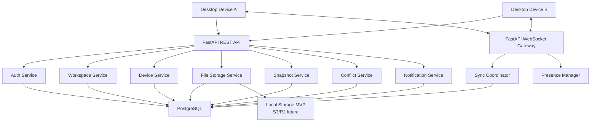
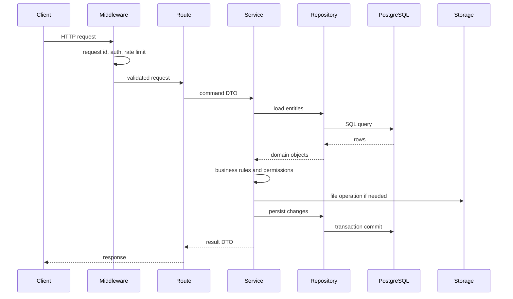

# DevSync Cloud Phase 1 Architecture

Project: **DevSync Cloud**  
Purpose: **Synchronization coordinator for DevSync desktop clients**  
Stack: **Python 3.13+, FastAPI, PostgreSQL, SQLAlchemy 2.0, Alembic, JWT, bcrypt/passlib, Pydantic, FastAPI WebSockets, local filesystem storage for MVP**

This is Phase 1 only. It defines the cloud backend architecture and stops before implementation.

## 1. System Architecture

DevSync Cloud is the central coordination service for user accounts, devices, workspace membership, sync event ordering, file storage, snapshots, conflicts, and realtime notifications.

The desktop app remains responsible for watching local folders. The cloud server does not watch local files. It receives trusted events from devices, validates permissions, stores metadata/files, and broadcasts updates to other devices.



## 2. Clean Architecture Layers

```text
API Layer
  FastAPI routes, WebSocket handlers, middleware

Application Layer
  Services, use cases, transaction orchestration

Domain Layer
  Entities, permissions, sync rules, conflict policies

Infrastructure Layer
  SQLAlchemy repositories, storage adapters, JWT, password hashing, email provider future
```

Rules:

1. Routes only validate request/response data and call services.
2. Services contain workflows.
3. Repositories hide database details.
4. Storage provider hides local/S3/R2 differences.
5. WebSocket handlers call sync services; they do not contain sync business logic.

## 3. Folder Structure

```text
server/
  app/
    main.py
    config/
      settings.py
      logging.py
    database/
      engine.py
      session.py
      base.py
      migrations/
    auth/
      routes.py
      schemas.py
      services.py
      repositories.py
      models.py
      security.py
    users/
      routes.py
      schemas.py
      services.py
      repositories.py
      models.py
    workspaces/
      routes.py
      schemas.py
      services.py
      repositories.py
      models.py
      permissions.py
    teams/
      routes.py
      schemas.py
      services.py
      repositories.py
      models.py
    devices/
      routes.py
      schemas.py
      services.py
      repositories.py
      models.py
    sync/
      routes.py
      schemas.py
      services.py
      repositories.py
      models.py
      queue.py
      coordinator.py
    storage/
      routes.py
      schemas.py
      services.py
      providers.py
      local_provider.py
      models.py
    snapshots/
      routes.py
      schemas.py
      services.py
      repositories.py
      models.py
    conflicts/
      routes.py
      schemas.py
      services.py
      repositories.py
      models.py
    notifications/
      routes.py
      schemas.py
      services.py
      repositories.py
      models.py
    websocket/
      gateway.py
      manager.py
      events.py
      schemas.py
    middleware/
      auth.py
      rate_limit.py
      request_id.py
    utils/
      time.py
      pagination.py
      errors.py
  tests/
    unit/
    integration/
    websocket/
  docs/
  scripts/
  storage/
```

## 4. Bounded Contexts

| Context | Responsibility |
|---|---|
| Auth | Register, login, logout, refresh token, sessions, password hashing |
| Users | Profile, account settings, account deletion |
| Workspaces | Workspace lifecycle, metadata, settings |
| Teams | Invitations, roles, permission management |
| Devices | Device registration, trust, heartbeat, online state |
| Sync | Sync events, event history, ordering, retry metadata, bandwidth tracking |
| Storage | Upload/download/replace/delete files, local storage adapter |
| Conflicts | Detect/store/resolve conflict metadata |
| Snapshots | Create/restore/delete snapshots and workspace timeline |
| Notifications | User and device notifications |
| WebSocket | Realtime event delivery and presence |

## 5. PostgreSQL Database Schema

All tables include `created_at` and `updated_at`. Tables with soft delete include `deleted_at`.

### users

| Column | Type | Constraints |
|---|---|---|
| id | UUID | PK |
| email | CITEXT | Unique, not null |
| password_hash | TEXT | Not null |
| display_name | VARCHAR(120) | Not null |
| avatar_url | TEXT | Nullable |
| status | VARCHAR(30) | active, disabled, deleted |
| created_at | TIMESTAMPTZ | Not null |
| updated_at | TIMESTAMPTZ | Not null |
| deleted_at | TIMESTAMPTZ | Nullable |

Indexes:

1. `uq_users_email`
2. `idx_users_status`

### sessions

| Column | Type | Constraints |
|---|---|---|
| id | UUID | PK |
| user_id | UUID | FK users.id, not null |
| device_id | UUID | FK devices.id, nullable |
| refresh_token_hash | TEXT | Unique, not null |
| expires_at | TIMESTAMPTZ | Not null |
| revoked_at | TIMESTAMPTZ | Nullable |
| created_at | TIMESTAMPTZ | Not null |
| updated_at | TIMESTAMPTZ | Not null |

Indexes:

1. `idx_sessions_user_id`
2. `idx_sessions_device_id`
3. `idx_sessions_expires_at`

### devices

| Column | Type | Constraints |
|---|---|---|
| id | UUID | PK |
| user_id | UUID | FK users.id, not null |
| name | VARCHAR(120) | Not null |
| platform | VARCHAR(60) | Not null |
| public_key | TEXT | Nullable MVP, required later |
| trust_status | VARCHAR(30) | pending, trusted, revoked |
| last_seen_at | TIMESTAMPTZ | Nullable |
| created_at | TIMESTAMPTZ | Not null |
| updated_at | TIMESTAMPTZ | Not null |
| deleted_at | TIMESTAMPTZ | Nullable |

Indexes:

1. `idx_devices_user_id`
2. `idx_devices_trust_status`
3. `idx_devices_last_seen_at`

### workspaces

| Column | Type | Constraints |
|---|---|---|
| id | UUID | PK |
| owner_id | UUID | FK users.id, not null |
| name | VARCHAR(160) | Not null |
| slug | VARCHAR(180) | Not null |
| status | VARCHAR(30) | active, archived, deleted |
| settings | JSONB | Not null default `{}` |
| storage_bytes | BIGINT | Not null default 0 |
| created_at | TIMESTAMPTZ | Not null |
| updated_at | TIMESTAMPTZ | Not null |
| archived_at | TIMESTAMPTZ | Nullable |
| deleted_at | TIMESTAMPTZ | Nullable |

Indexes:

1. `idx_workspaces_owner_id`
2. `idx_workspaces_status`
3. Unique `owner_id, slug` for active non-deleted workspaces

### workspace_members

| Column | Type | Constraints |
|---|---|---|
| id | UUID | PK |
| workspace_id | UUID | FK workspaces.id, not null |
| user_id | UUID | FK users.id, not null |
| role | VARCHAR(30) | owner, admin, developer, viewer |
| status | VARCHAR(30) | active, removed |
| joined_at | TIMESTAMPTZ | Not null |
| created_at | TIMESTAMPTZ | Not null |
| updated_at | TIMESTAMPTZ | Not null |
| deleted_at | TIMESTAMPTZ | Nullable |

Indexes:

1. Unique `workspace_id, user_id`
2. `idx_workspace_members_user_id`
3. `idx_workspace_members_role`

### invitations

| Column | Type | Constraints |
|---|---|---|
| id | UUID | PK |
| workspace_id | UUID | FK workspaces.id, not null |
| invited_by_id | UUID | FK users.id, not null |
| email | CITEXT | Not null |
| role | VARCHAR(30) | Not null |
| token_hash | TEXT | Unique, not null |
| status | VARCHAR(30) | pending, accepted, rejected, expired |
| expires_at | TIMESTAMPTZ | Not null |
| accepted_at | TIMESTAMPTZ | Nullable |
| created_at | TIMESTAMPTZ | Not null |
| updated_at | TIMESTAMPTZ | Not null |

Indexes:

1. `idx_invitations_workspace_id`
2. `idx_invitations_email`
3. `idx_invitations_status`

### files

| Column | Type | Constraints |
|---|---|---|
| id | UUID | PK |
| workspace_id | UUID | FK workspaces.id, not null |
| path | TEXT | Not null |
| file_type | VARCHAR(30) | file, folder |
| current_version_id | UUID | FK file_versions.id, nullable |
| deleted_at | TIMESTAMPTZ | Nullable |
| created_at | TIMESTAMPTZ | Not null |
| updated_at | TIMESTAMPTZ | Not null |

Indexes:

1. Unique `workspace_id, path`
2. `idx_files_workspace_id`
3. `idx_files_deleted_at`

### file_versions

| Column | Type | Constraints |
|---|---|---|
| id | UUID | PK |
| file_id | UUID | FK files.id, not null |
| workspace_id | UUID | FK workspaces.id, not null |
| created_by_device_id | UUID | FK devices.id, not null |
| content_checksum | VARCHAR(128) | Not null |
| size_bytes | BIGINT | Not null |
| storage_key | TEXT | Not null |
| version_number | BIGINT | Not null |
| created_at | TIMESTAMPTZ | Not null |

Indexes:

1. `idx_file_versions_file_id`
2. `idx_file_versions_workspace_id`
3. Unique `file_id, version_number`
4. `idx_file_versions_checksum`

### sync_events

| Column | Type | Constraints |
|---|---|---|
| id | UUID | PK |
| workspace_id | UUID | FK workspaces.id, not null |
| sender_device_id | UUID | FK devices.id, not null |
| event_type | VARCHAR(50) | Not null |
| sequence | BIGINT | Not null |
| path | TEXT | Nullable |
| payload | JSONB | Not null |
| status | VARCHAR(30) | accepted, rejected, superseded |
| bandwidth_bytes | BIGINT | Not null default 0 |
| created_at | TIMESTAMPTZ | Not null |

Indexes:

1. Unique `workspace_id, sequence`
2. `idx_sync_events_workspace_created`
3. `idx_sync_events_sender_device`

### conflicts

| Column | Type | Constraints |
|---|---|---|
| id | UUID | PK |
| workspace_id | UUID | FK workspaces.id, not null |
| file_id | UUID | FK files.id, nullable |
| path | TEXT | Not null |
| local_version_id | UUID | FK file_versions.id, nullable |
| remote_version_id | UUID | FK file_versions.id, nullable |
| status | VARCHAR(30) | open, resolved |
| resolution | VARCHAR(30) | nullable |
| resolved_by_id | UUID | FK users.id, nullable |
| resolved_at | TIMESTAMPTZ | Nullable |
| created_at | TIMESTAMPTZ | Not null |
| updated_at | TIMESTAMPTZ | Not null |

Indexes:

1. `idx_conflicts_workspace_id`
2. `idx_conflicts_status`
3. `idx_conflicts_path`

### snapshots

| Column | Type | Constraints |
|---|---|---|
| id | UUID | PK |
| workspace_id | UUID | FK workspaces.id, not null |
| created_by_id | UUID | FK users.id, not null |
| name | VARCHAR(160) | Not null |
| manifest | JSONB | Not null |
| file_count | INTEGER | Not null |
| storage_bytes | BIGINT | Not null |
| created_at | TIMESTAMPTZ | Not null |
| deleted_at | TIMESTAMPTZ | Nullable |

Indexes:

1. `idx_snapshots_workspace_id`
2. `idx_snapshots_created_at`

### notifications

| Column | Type | Constraints |
|---|---|---|
| id | UUID | PK |
| user_id | UUID | FK users.id, not null |
| workspace_id | UUID | FK workspaces.id, nullable |
| type | VARCHAR(60) | Not null |
| title | VARCHAR(180) | Not null |
| body | TEXT | Not null |
| read_at | TIMESTAMPTZ | Nullable |
| created_at | TIMESTAMPTZ | Not null |

Indexes:

1. `idx_notifications_user_id`
2. `idx_notifications_read_at`
3. `idx_notifications_created_at`

## 6. API List

All REST APIs are under `/v1`.

### Authentication

| Method | Path | Purpose | Status Codes |
|---|---|---|---|
| POST | `/auth/register` | Register user | 201, 409, 422 |
| POST | `/auth/login` | Login and issue tokens | 200, 401, 422 |
| POST | `/auth/logout` | Revoke current session | 204, 401 |
| POST | `/auth/refresh` | Rotate refresh token | 200, 401 |

Register request:

```json
{
  "email": "user@example.com",
  "password": "strong-password",
  "display_name": "Shrey"
}
```

Login response:

```json
{
  "access_token": "...",
  "refresh_token": "...",
  "token_type": "bearer",
  "expires_in": 900
}
```

### Users

| Method | Path | Purpose | Status Codes |
|---|---|---|---|
| GET | `/users/me` | Current profile | 200, 401 |
| PATCH | `/users/me` | Update profile/settings | 200, 401, 422 |
| DELETE | `/users/me` | Soft delete account | 204, 401 |
| GET | `/users/me/devices` | List current user's devices | 200, 401 |

### Workspaces

| Method | Path | Purpose | Status Codes |
|---|---|---|---|
| POST | `/workspaces` | Create workspace | 201, 401, 422 |
| GET | `/workspaces` | List workspaces | 200, 401 |
| GET | `/workspaces/{workspace_id}` | Workspace info | 200, 403, 404 |
| PATCH | `/workspaces/{workspace_id}` | Rename/update settings | 200, 403, 404 |
| POST | `/workspaces/{workspace_id}/archive` | Archive workspace | 200, 403, 404 |
| DELETE | `/workspaces/{workspace_id}` | Soft delete workspace | 204, 403, 404 |

### Members and Invitations

| Method | Path | Purpose | Status Codes |
|---|---|---|---|
| POST | `/workspaces/{workspace_id}/invitations` | Invite member | 201, 403, 404 |
| POST | `/invitations/{token}/accept` | Accept invite | 200, 404, 410 |
| POST | `/invitations/{token}/reject` | Reject invite | 204, 404, 410 |
| GET | `/workspaces/{workspace_id}/members` | List members | 200, 403 |
| PATCH | `/workspaces/{workspace_id}/members/{member_id}` | Change role | 200, 403 |
| DELETE | `/workspaces/{workspace_id}/members/{member_id}` | Remove member | 204, 403 |

### Devices

| Method | Path | Purpose | Status Codes |
|---|---|---|---|
| POST | `/devices` | Register device | 201, 401, 422 |
| PATCH | `/devices/{device_id}` | Rename device | 200, 403, 404 |
| POST | `/devices/{device_id}/trust` | Trust device | 200, 403, 404 |
| DELETE | `/devices/{device_id}` | Remove/revoke device | 204, 403, 404 |
| POST | `/devices/{device_id}/heartbeat` | Update last seen | 204, 403, 404 |

### Files and Storage

| Method | Path | Purpose | Status Codes |
|---|---|---|---|
| POST | `/workspaces/{workspace_id}/files/upload` | Upload/replace file | 201, 403, 413 |
| GET | `/workspaces/{workspace_id}/files` | List files | 200, 403 |
| GET | `/workspaces/{workspace_id}/files/{file_id}/download` | Download current file | 200, 403, 404 |
| DELETE | `/workspaces/{workspace_id}/files/{file_id}` | Delete file | 204, 403, 404 |
| GET | `/workspaces/{workspace_id}/files/{file_id}/versions` | Version history | 200, 403 |
| POST | `/workspaces/{workspace_id}/files/{file_id}/restore` | Restore version | 200, 403 |

### Sync

| Method | Path | Purpose | Status Codes |
|---|---|---|---|
| POST | `/workspaces/{workspace_id}/sync/events` | Submit sync event | 202, 403, 409 |
| GET | `/workspaces/{workspace_id}/sync/events` | List/replay events | 200, 403 |
| POST | `/workspaces/{workspace_id}/sync/ack` | Acknowledge events | 204, 403 |
| GET | `/workspaces/{workspace_id}/sync/history` | Sync history | 200, 403 |

### Snapshots

| Method | Path | Purpose | Status Codes |
|---|---|---|---|
| POST | `/workspaces/{workspace_id}/snapshots` | Create snapshot | 201, 403 |
| GET | `/workspaces/{workspace_id}/snapshots` | List snapshots | 200, 403 |
| POST | `/workspaces/{workspace_id}/snapshots/{snapshot_id}/restore` | Restore snapshot | 202, 403, 404 |
| DELETE | `/workspaces/{workspace_id}/snapshots/{snapshot_id}` | Delete snapshot | 204, 403 |

### Conflicts

| Method | Path | Purpose | Status Codes |
|---|---|---|---|
| GET | `/workspaces/{workspace_id}/conflicts` | List conflicts | 200, 403 |
| POST | `/workspaces/{workspace_id}/conflicts/{conflict_id}/resolve` | Resolve conflict | 200, 403, 404 |

### Notifications

| Method | Path | Purpose | Status Codes |
|---|---|---|---|
| GET | `/notifications` | List notifications | 200, 401 |
| POST | `/notifications/{notification_id}/read` | Mark read | 204, 401 |
| POST | `/notifications/read-all` | Mark all read | 204, 401 |

## 7. WebSocket Events

Endpoint: `/v1/ws`

Connection authentication:

1. Client connects with access token.
2. Client sends `workspace_join`.
3. Server validates user membership and device trust.
4. Server subscribes connection to workspace room.

### Client Events

| Event | Purpose | Payload |
|---|---|---|
| `workspace_join` | Subscribe to workspace updates | `{ "workspace_id": "...", "last_sequence": 42 }` |
| `workspace_leave` | Unsubscribe | `{ "workspace_id": "..." }` |
| `device_heartbeat` | Keep device online | `{ "device_id": "...", "workspace_id": "..." }` |
| `sync_event` | Submit file change metadata | `{ "workspace_id": "...", "event_type": "file_changed", "path": "...", "payload": {} }` |
| `sync_ack` | Acknowledge event application | `{ "workspace_id": "...", "sequence": 43 }` |

### Server Events

| Event | Purpose | Sender | Receiver | Payload |
|---|---|---|---|---|
| `device_connected` | Device came online | Server | Workspace members | `{ "device_id": "...", "name": "Laptop" }` |
| `device_disconnected` | Device went offline | Server | Workspace members | `{ "device_id": "..." }` |
| `workspace_updated` | Workspace metadata changed | Server | Workspace members | `{ "workspace_id": "...", "name": "New name" }` |
| `file_changed` | File version changed | Device via server | Other workspace devices | `{ "sequence": 44, "path": "src/app.py", "file_id": "...", "version_id": "..." }` |
| `file_deleted` | File was deleted | Device via server | Other workspace devices | `{ "sequence": 45, "path": "old.txt" }` |
| `conflict_detected` | Server recorded conflict | Server | Affected users/devices | `{ "conflict_id": "...", "path": "src/app.py" }` |
| `snapshot_created` | Snapshot available | Server | Workspace members | `{ "snapshot_id": "...", "name": "Before restore" }` |
| `sync_completed` | Event acknowledged/applied | Server | Sender device | `{ "workspace_id": "...", "sequence": 44 }` |
| `notification_created` | New notification | Server | User devices | `{ "notification_id": "...", "type": "invite_received" }` |

Flow for `file_changed`:

1. Device A uploads file/version if needed.
2. Device A sends `sync_event`.
3. Server validates device/workspace permission.
4. Server assigns workspace sequence.
5. Server stores sync event.
6. Server broadcasts `file_changed` to Device B and other subscribed devices.
7. Device B downloads file/version.
8. Device B sends `sync_ack`.

## 8. Storage Architecture

### MVP Local Storage

```text
server/storage/
  workspaces/
    {workspace_id}/
      files/
        current/
          src/
            app.py
        versions/
          {file_id}/
            {version_id}.bin
      snapshots/
        {snapshot_id}.json
```

### Storage Provider Interface

```text
StorageProvider
  save_file(workspace_id, storage_key, stream)
  read_file(workspace_id, storage_key)
  delete_file(workspace_id, storage_key)
  exists(workspace_id, storage_key)
  checksum(workspace_id, storage_key)
```

Implementations:

1. `LocalStorageProvider` for MVP.
2. `S3StorageProvider` later.
3. `CloudflareR2StorageProvider` later.

Business logic talks only to `StorageProvider`, never directly to local filesystem or S3 SDKs.

Upload safety:

1. Maximum file size enforced.
2. Temporary upload path first.
3. Checksum verification.
4. Atomic move into final path.
5. Path traversal protection.
6. Workspace authorization before upload/download.

## 9. Authentication Flow

### Register

1. Client sends email, display name, password.
2. API validates email/password strength.
3. Password is hashed with bcrypt/passlib.
4. User row is created.
5. Optional first session is created.
6. Tokens are returned.

### Login

1. Client sends email and password.
2. API loads user by email.
3. Password hash is verified.
4. Session row is created.
5. Access JWT and refresh token are issued.

### Refresh

1. Client sends refresh token.
2. Server hashes token and finds session.
3. Server verifies session is active and unexpired.
4. Old refresh token is revoked/rotated.
5. New access and refresh tokens are returned.

### Device Authorization

1. Logged-in user registers device.
2. Device starts as pending or trusted depending on policy.
3. Workspace access requires trusted device.
4. Revoked devices cannot connect to WebSocket or submit sync events.

## 10. Request Lifecycle



Principles:

1. One database transaction per use case.
2. Permission checks happen inside services.
3. Routes do not access repositories directly.
4. Errors become consistent API responses.
5. Audit logs are written for sensitive actions.

## 11. Permission System

Roles:

| Role | Permissions |
|---|---|
| Owner | Full access, delete workspace, manage members/devices |
| Admin | Manage workspace, members, devices, files |
| Developer | Read/write files, create snapshots, resolve own conflicts |
| Viewer | Read files and activity only |

Permission checks:

1. User must be an active workspace member.
2. Device must be trusted.
3. Role must allow requested action.
4. Workspace must be active unless action is restore/archive/admin-specific.

## 12. Security Controls

| Area | Control |
|---|---|
| JWT | Short-lived access tokens |
| Refresh tokens | Stored hashed, rotated |
| Passwords | bcrypt/passlib |
| API auth | Middleware validates token |
| Workspace auth | Service-level permission checks |
| Device auth | Trusted device required for sync |
| Uploads | Size limits, checksum, safe paths |
| Rate limiting | Per IP/user/device |
| Audit logs | Sensitive operations recorded |
| Input validation | Pydantic schemas |
| CORS | Restrict to known clients in production |

## 13. Logging and Observability

Use structured Python logging with request ids.

Log:

1. Auth events.
2. Device registration/trust/revocation.
3. Workspace lifecycle changes.
4. Sync event accept/reject.
5. Upload/download failures.
6. Conflict creation/resolution.
7. Snapshot restore.

Never log:

1. Passwords.
2. Raw tokens.
3. Private file contents.
4. Secret keys.

## 14. Phase Plan

### Phase 2: Authentication

Implement:

1. Settings.
2. DB session.
3. User/session models.
4. Auth schemas.
5. Password hashing.
6. JWT/refresh tokens.
7. Register/login/logout/refresh routes.
8. Tests.

### Phase 3: Workspace Management

Implement workspace models, repositories, services, routes, permissions, and tests.

### Phase 4: Device Registration

Implement devices, trust flow, heartbeat, device authorization, tests.

### Phase 5: Synchronization APIs

Implement sync event submission, history, replay, ack, conflict detection metadata.

### Phase 6: WebSocket Synchronization

Implement workspace rooms, connection manager, broadcasts, replay on reconnect.

### Phase 7: Storage

Implement local storage provider, uploads/downloads/version metadata, checksum verification.

### Phase 8: Snapshots

Implement snapshot creation, timeline, restore metadata and event generation.

### Phase 9: Testing

Add full unit, integration, API, WebSocket, and storage tests.

### Phase 10: Optimization

Add pagination, indexes review, rate limiting, background jobs, large-file safeguards.

## 15. Approval Gate

Phase 1 is complete when this architecture is approved.

Next step after approval: **Phase 2: Authentication** only.

