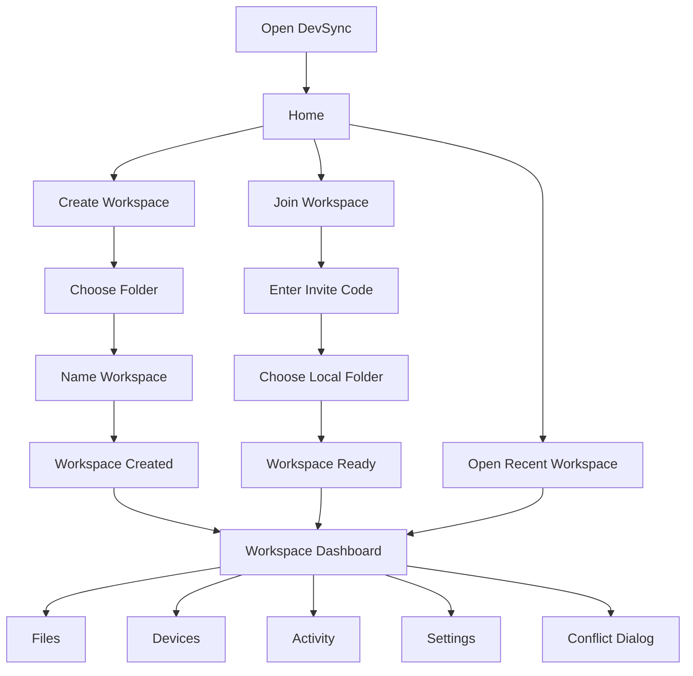
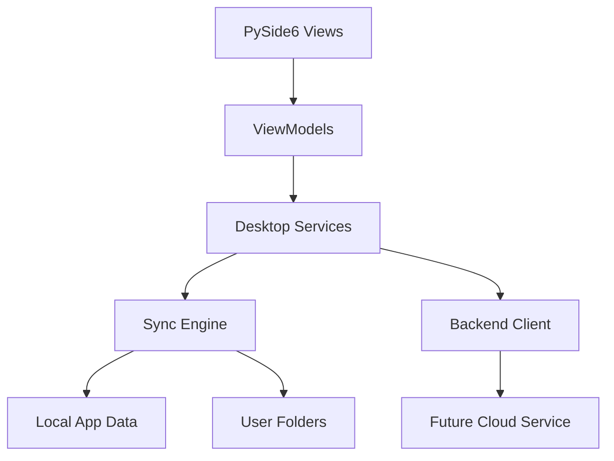

# DevSync Desktop UX Design

Application: **DevSync**  
Tagline: **Your files stay together, wherever you work.**  
Platform: **Python + PySide6 desktop app**  
Design direction: **Dark, modern, friendly, beginner-first**

This document is the complete design phase. No desktop implementation should start until this UX design is approved.

## 1. User Journey

### First-Time User

1. User opens DevSync.
2. They see a friendly welcome screen with two primary choices:
   - Create Workspace
   - Join Workspace
3. If creating:
   - Choose a folder.
   - Name the workspace.
   - Click Create.
4. DevSync starts keeping that folder up to date.
5. The user lands on the workspace dashboard and sees:
   - Everything is up to date.
   - Current device.
   - Recent activity.
   - Add another device.

### Returning User

1. User opens DevSync.
2. Home shows recent workspaces.
3. User clicks a workspace.
4. Dashboard opens with current sync status, devices, recent files, and activity.

### Person Joining a Workspace

1. User clicks Join Workspace.
2. Enters invite code.
3. Chooses where the workspace should live on this device.
4. DevSync prepares the folder.
5. Dashboard opens when ready.

### Problem Recovery

1. DevSync detects a problem.
2. User sees a plain-language alert:
   - "This file was changed on two devices."
3. User chooses:
   - Keep Mine
   - Keep Other
   - Compare
   - Save Both
4. DevSync applies the choice and returns to normal.

## 2. UX Flow



## 3. Information Architecture

Top-level sections:

| Section | User Meaning | Main Content |
|---|---|---|
| Home | Start here | Create, join, recent workspaces |
| Workspaces | My synced folders | Workspace list, favorites, archive |
| Devices | My computers | Connected devices, status, trust |
| Activity | What changed | Recent syncs, alerts, conflicts |
| Settings | Preferences | Theme, notifications, startup, limits |

Inside a workspace:

| Area | Purpose |
|---|---|
| Dashboard | Quick health overview |
| Files | Familiar folder tree and search |
| Devices | Devices connected to this workspace |
| History | Previous versions and deleted files |
| Activity | Workspace-specific events |
| Settings | Workspace preferences |

## 4. Navigation

### App Sidebar

Persistent left sidebar:

```text
DevSync

Home
Workspaces
Devices
Activity
Settings

Recent
  Game Project
  College App
  Portfolio Site
```

Behavior:

1. Sidebar is always visible on desktop widths.
2. Recent workspaces appear under main navigation.
3. Active section has blue accent pill.
4. Collapsed mode shows icons only.
5. Tooltips appear in collapsed mode.

### Workspace Header

When inside a workspace:

```text
Game Project          Everything is up to date
[Sync Now] [Pause] [...]
```

## 5. Window Hierarchy

```text
MainWindow
  AppShell
    Sidebar
    TopBar
    ContentArea
    StatusBar

Dialogs
  CreateWorkspaceDialog
  JoinWorkspaceDialog
  ConflictDialog
  DeviceTrustDialog
  DeleteWorkspaceDialog
  RestoreVersionDialog
  PreferencesDialog

Toasts
  SyncCompletedToast
  DeviceConnectedToast
  ConflictDetectedToast
  StorageWarningToast
```

## 6. Screens

### 6.1 Welcome / Home

Purpose: Make the first action obvious.

Wireframe:

```text
┌────────────────────────────────────────────────────────────┐
│ DevSync                                                    │
│ Your files stay together, wherever you work.               │
│                                                            │
│ ┌────────────────────┐  ┌────────────────────┐             │
│ │ Create Workspace   │  │ Join Workspace     │             │
│ │ Choose a folder    │  │ Use an invite code │             │
│ └────────────────────┘  └────────────────────┘             │
│                                                            │
│ Recent Workspaces                                          │
│ ┌──────────────────────────────────────────────────────┐   │
│ │ Game Project       Up to date        2 devices       │   │
│ │ College App        Syncing now       1 device        │   │
│ └──────────────────────────────────────────────────────┘   │
└────────────────────────────────────────────────────────────┘
```

Empty state:

```text
No workspaces yet.
Create one from any folder on your computer.
```

Primary actions:

1. Create Workspace
2. Join Workspace

### 6.2 Create Workspace

Purpose: Let a non-technical user start syncing a folder in under one minute.

Steps:

```text
Step 1: Choose a folder
Step 2: Name your workspace
Step 3: Create
```

Wireframe:

```text
┌──────────────────────────────────────────┐
│ Create Workspace                         │
│                                          │
│ Folder                                   │
│ [ C:\Users\You\Desktop\Project     Browse ] │
│                                          │
│ Workspace Name                           │
│ [ Project ]                              │
│                                          │
│ Files like temporary folders and private │
│ settings are skipped automatically.      │
│                                          │
│                     [Cancel] [Create]    │
└──────────────────────────────────────────┘
```

Success state:

```text
Workspace created. DevSync is keeping it up to date.
```

Error states:

| Situation | Message |
|---|---|
| Folder missing | "We could not find that folder. Choose another one." |
| No permission | "DevSync cannot access this folder. Pick another folder or change permissions." |
| Already added | "This folder is already a workspace." |

### 6.3 Join Workspace

Purpose: Make joining simple.

Wireframe:

```text
┌──────────────────────────────────────────┐
│ Join Workspace                           │
│                                          │
│ Invite Code                              │
│ [ ABCD-1234-EFGH ]                       │
│                                          │
│ Save workspace here                      │
│ [ C:\Users\You\DevSync\Game Project Browse ] │
│                                          │
│                     [Cancel] [Join]      │
└──────────────────────────────────────────┘
```

Loading state:

```text
Preparing workspace...
```

Error state:

```text
That invite code did not work. Check it and try again.
```

### 6.4 Workspace Dashboard

Purpose: Show health, not technical detail.

Wireframe:

```text
┌ Sidebar ───────┬───────────────────────────────────────────┐
│ Home           │ Game Project                              │
│ Workspaces     │ Everything is up to date                  │
│ Devices        │                         [Sync Now] [Pause]│
│ Activity       │                                           │
│ Settings       │ ┌──────────┐ ┌──────────┐ ┌──────────┐   │
│                │ │ Devices  │ │ Storage  │ │ Activity │   │
│ Recent         │ │ 2 online │ │ 420 MB   │ │ 12 today │   │
│ Game Project   │ └──────────┘ └──────────┘ └──────────┘   │
│                │                                           │
│                │ Recent Activity                           │
│                │ 10:42  app.py synchronized                │
│                │ 10:38  Laptop connected                   │
│                │ 10:31  Workspace created                  │
├────────────────┴───────────────────────────────────────────┤
│ Up to date   Network: Online   Storage: Healthy            │
└────────────────────────────────────────────────────────────┘
```

States:

| State | Display |
|---|---|
| Up to date | Green check, "Everything is up to date" |
| Syncing | Blue spinner, "Updating files..." |
| Paused | Yellow pause icon, "Syncing is paused" |
| Offline | Gray cloud icon, "Offline. Changes will sync later." |
| Problem | Red alert, "Some files need your attention" |

### 6.5 Workspaces

Purpose: Manage synced folders.

Wireframe:

```text
┌────────────────────────────────────────────────────────────┐
│ Workspaces                                    [Create]      │
│ [Search workspaces]                                         │
│                                                            │
│ ★ Game Project      Up to date      2 devices     [...]    │
│   College App       Offline         1 device      [...]    │
│   Portfolio Site    Paused          1 device      [...]    │
└────────────────────────────────────────────────────────────┘
```

Workspace menu:

1. Rename
2. Favorite
3. Duplicate
4. Archive
5. Delete

Delete confirmation:

```text
Delete workspace?
This will remove it from DevSync on this device. Your folder can be kept.
[Cancel] [Delete]
```

### 6.6 File Explorer

Purpose: Familiar folder view.

Wireframe:

```text
┌────────────────────────────────────────────────────────────┐
│ Files                                      [Search files]   │
│                                                            │
│ Favorites                  Details                         │
│ ┌──────────────────┐       ┌────────────────────────────┐  │
│ │ src              │       │ main.py                    │  │
│ │ assets           │       │ Updated 2 minutes ago      │  │
│ │ README.md        │       │ Available on 2 devices     │  │
│ └──────────────────┘       └────────────────────────────┘  │
└────────────────────────────────────────────────────────────┘
```

Actions:

1. Open in File Explorer
2. Favorite
3. View history
4. Restore previous version

### 6.7 Devices

Purpose: Show where the workspace exists.

Wireframe:

```text
┌────────────────────────────────────────────────────────────┐
│ Devices                                      [Add Device]   │
│                                                            │
│ ┌──────────────────────────────────────────────────────┐   │
│ │ Desktop PC      Online      Synced just now          │   │
│ │ Laptop          Offline     Last synced 1 hour ago   │   │
│ │ Office PC       Pending     Waiting for approval     │   │
│ └──────────────────────────────────────────────────────┘   │
└────────────────────────────────────────────────────────────┘
```

Device trust dialog:

```text
New device wants to connect
"Shrey's Laptop" wants access to Game Project.
[Deny] [Trust Device]
```

### 6.8 Activity

Purpose: Give confidence that DevSync is doing work.

Wireframe:

```text
┌────────────────────────────────────────────────────────────┐
│ Activity                                                   │
│ [All] [Files] [Devices] [Warnings]                         │
│                                                            │
│ Today                                                      │
│ 10:44  main.py updated on Desktop PC                       │
│ 10:43  Laptop received latest files                        │
│ 10:40  New device connected                                │
│                                                            │
│ Yesterday                                                  │
│ 21:18  Project folder restored                             │
└────────────────────────────────────────────────────────────┘
```

### 6.9 Conflict Dialog

Purpose: Make conflict resolution understandable.

Message:

```text
This file was changed on two devices.
Choose which version you want to keep.
```

Wireframe:

```text
┌──────────────────────────────────────────┐
│ This file was changed on two devices     │
│                                          │
│ File: src/main.py                        │
│                                          │
│ Your version       Other device version  │
│ Edited 10:42       Edited 10:43          │
│                                          │
│ [Keep Mine] [Keep Other] [Compare]       │
│ [Save Both]                              │
└──────────────────────────────────────────┘
```

No technical wording. Avoid words like merge unless user opens advanced compare.

### 6.10 Version History

Purpose: Recover from mistakes.

Wireframe:

```text
┌────────────────────────────────────────────────────────────┐
│ History: main.py                                           │
│                                                            │
│ Current version       Today 10:44                          │
│ Previous version      Today 10:20       [Restore]          │
│ Previous version      Yesterday 19:02   [Restore]          │
└────────────────────────────────────────────────────────────┘
```

Restore confirmation:

```text
Restore this version?
DevSync will save your current version first, just in case.
[Cancel] [Restore]
```

### 6.11 Settings

Purpose: Keep preferences approachable.

Sections:

1. General
2. Syncing
3. Notifications
4. Devices
5. Advanced

Wireframe:

```text
┌────────────────────────────────────────────────────────────┐
│ Settings                                                   │
│                                                            │
│ General                                                    │
│ [x] Start DevSync when I sign in                           │
│ Theme: Dark                                                │
│ Language: English                                          │
│                                                            │
│ Syncing                                                    │
│ [x] Keep syncing in the background                         │
│ Speed limit: No limit                                      │
│ Ignored folders: node_modules, .git, build                 │
│                                                            │
│ Notifications                                              │
│ [x] Tell me when a device connects                         │
│ [x] Tell me when a file needs attention                    │
└────────────────────────────────────────────────────────────┘
```

## 7. Component Tree

```text
MainWindow
  AppShell
    Sidebar
      NavItem
      RecentWorkspaceItem
    TopBar
      WorkspaceTitle
      SyncStatusBadge
      PrimaryActionButton
    ContentStack
      HomeScreen
      WorkspaceListScreen
      WorkspaceDashboardScreen
      FileExplorerScreen
      DevicesScreen
      ActivityScreen
      SettingsScreen
    StatusBar
      SyncIndicator
      NetworkIndicator
      StorageIndicator

Dialogs
  CreateWorkspaceDialog
  JoinWorkspaceDialog
  ConflictDialog
  ConfirmDialog
  DeviceTrustDialog

Shared Widgets
  Button
  IconButton
  Card
  SearchBox
  EmptyState
  LoadingState
  Toast
  StatusPill
  DeviceCard
  ActivityRow
  WorkspaceCard
```

## 8. UI Design Decisions

| Decision | Reason |
|---|---|
| Dark mode first | Matches developer tools and modern desktop apps |
| Blue accent | Communicates trust, clarity, and action |
| Large primary actions | Beginner-friendly onboarding |
| Plain-language alerts | Users should not need technical knowledge |
| Sidebar navigation | Familiar from Discord, VS Code, Spotify |
| Cards only for summaries/lists | Keeps UI clean without nesting clutter |
| Status bar | Always shows sync confidence |
| Progressive disclosure | Advanced details are hidden until needed |

## 9. Visual System

### Colors

| Token | Value | Usage |
|---|---|---|
| `bg_main` | `#0F1117` | App background |
| `bg_panel` | `#171A21` | Sidebar and panels |
| `bg_card` | `#20242D` | Cards and list rows |
| `border` | `#2D3340` | Subtle borders |
| `text_primary` | `#F3F6FA` | Main text |
| `text_secondary` | `#AAB3C2` | Supporting text |
| `accent` | `#4C8DFF` | Primary action |
| `success` | `#35C46B` | Up-to-date state |
| `warning` | `#F5B84B` | Paused/warning |
| `danger` | `#F05D5E` | Conflict/destructive |

### Typography

| Style | Size | Weight |
|---|---:|---:|
| Page title | 24 | 700 |
| Section title | 18 | 600 |
| Body | 14 | 400 |
| Small label | 12 | 500 |
| Status text | 13 | 500 |

### Spacing

Base spacing: `8px`

| Token | Value |
|---|---:|
| `space_xs` | 4 |
| `space_sm` | 8 |
| `space_md` | 16 |
| `space_lg` | 24 |
| `space_xl` | 32 |

### Corners

| Element | Radius |
|---|---:|
| Buttons | 8 |
| Cards | 10 |
| Dialogs | 14 |
| Sidebar selection | 8 |

## 10. Icon System

Use simple line icons. Suggested icon meanings:

| Feature | Icon |
|---|---|
| Home | House |
| Workspaces | Folder |
| Devices | Monitor |
| Activity | Clock |
| Settings | Gear |
| Syncing | Refresh arrows |
| Up to date | Check circle |
| Offline | Cloud off |
| Warning | Alert triangle |
| Delete | Trash |
| Search | Magnifying glass |
| Favorite | Star |

In PySide6, icons should be loaded through a central `IconProvider` so they can later be replaced without touching screens.

## 11. Animation and Motion

Keep motion subtle:

1. Sidebar selection fades in over 120ms.
2. Cards lift slightly on hover.
3. Loading spinner appears for active syncing.
4. Toast notifications slide in from bottom-right.
5. Dialogs scale/fade in quickly.

Animations should never block work.

## 12. Empty, Loading, Error, Success States

### Empty States

| Screen | Message |
|---|---|
| Home | "No workspaces yet. Create one from any folder." |
| Devices | "No other devices connected yet." |
| Activity | "No activity yet. Changes will appear here." |
| Files | "This workspace has no files yet." |

### Loading States

| Situation | Message |
|---|---|
| Creating workspace | "Creating workspace..." |
| Joining workspace | "Preparing your folder..." |
| Syncing | "Updating files..." |
| Restoring | "Restoring files..." |

### Error States

| Technical Cause | Friendly Message |
|---|---|
| File permission denied | "DevSync cannot access this file." |
| Verification failed | "File verification failed. Please try syncing again." |
| Network disconnected | "You are offline. Changes will sync later." |
| Conflict | "This file was changed on two devices." |

### Success States

| Action | Message |
|---|---|
| Workspace created | "Workspace created." |
| Sync complete | "Everything is up to date." |
| Device trusted | "Device connected." |
| Restore complete | "Files restored." |

## 13. Accessibility

Requirements:

1. Minimum button height: 36px.
2. Keyboard navigation for all primary actions.
3. Tooltips for icon-only buttons.
4. Clear focus rings.
5. Confirmation before delete/archive/restore.
6. Text contrast meets readable dark-mode contrast.
7. No status shown by color alone; always include text.

Keyboard shortcuts:

| Shortcut | Action |
|---|---|
| `Ctrl+N` | Create workspace |
| `Ctrl+J` | Join workspace |
| `Ctrl+F` | Search current screen |
| `Ctrl+R` | Sync now |
| `Ctrl+,` | Settings |

## 14. Folder Structure

Planned desktop structure:

```text
desktop/
  app/
    main.py
    presentation/
      windows/
      screens/
      dialogs/
      widgets/
    viewmodels/
    models/
    services/
    resources/
      icons/
      images/
      fonts/
    themes/
      dark.qss
      light.qss
    utilities/
```

Responsibilities:

| Folder | Purpose |
|---|---|
| `presentation` | PySide6 widgets and windows only |
| `viewmodels` | Screen state and user actions |
| `models` | UI-friendly data models |
| `services` | Calls into sync engine and backend client |
| `resources` | Icons, images, fonts |
| `themes` | QSS styling |
| `utilities` | UI helpers |

## 15. Theme System

Use a central theme manager:

```text
ThemeManager
  load_theme("dark")
  apply(app)
  tokens()
```

Theme files:

```text
desktop/app/themes/dark.qss
desktop/app/themes/light.qss
```

No screen should hardcode colors. Screens use shared widgets and theme tokens.

## 16. State Management

MVVM pattern:

```text
View
  PySide6 widget

ViewModel
  exposes state
  handles button actions
  emits change signals

Service
  sync engine / backend / local database
```

Example:

```text
CreateWorkspaceDialog
  -> CreateWorkspaceViewModel
    -> WorkspaceService
      -> Local sync engine
```

State categories:

| State | Owner |
|---|---|
| Current user | App state |
| Recent workspaces | Workspace service |
| Current workspace | Workspace view model |
| Sync status | Sync monitor service |
| Devices | Device service |
| Activity | Activity service |
| Settings | Settings service |

## 17. Application Architecture



Layers:

| Layer | Responsibility |
|---|---|
| UI | Screens, dialogs, widgets |
| ViewModels | UI state and commands |
| Services | App workflows |
| Sync Engine | Local folder monitoring and syncing |
| Networking | Future remote device sync |
| Storage | Local data, settings, history |

## 18. Screen Implementation Order

Recommended build order after approval:

1. App shell with sidebar, top bar, status bar.
2. Home screen.
3. Create Workspace dialog.
4. Workspace dashboard.
5. Workspaces list.
6. Activity screen.
7. Devices screen.
8. Settings screen.
9. File explorer screen.
10. Conflict dialog.
11. Version history dialog.

## 19. Approval Gate

This design phase is complete when approved.

After approval, implementation should start with:

1. PySide6 theme system.
2. Main window shell.
3. Home screen.
4. Create Workspace dialog connected to current local DevSync engine.
5. Dashboard showing current workspace status.

