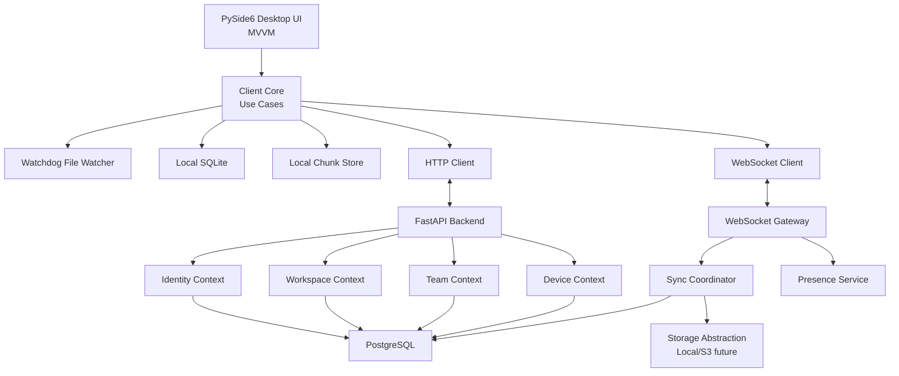
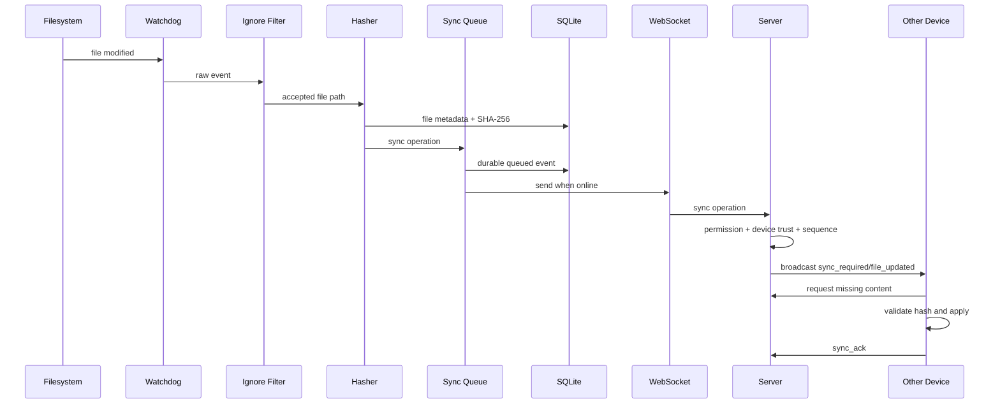

# DevSync Phase 1 Architecture

Product: **DevSync**  
Tagline: **Your development workspace follows you everywhere.**  
Stack: **Python 3.13+, FastAPI, PySide6, PostgreSQL, SQLite, HTTP, WebSockets**

This document is Phase 1 only. It defines the architecture and implementation plan. No further implementation should begin until this architecture is approved.

## 1. System Architecture

DevSync is a local-first developer workspace synchronization platform. Git remains responsible for committed source history. DevSync manages the live working environment: uncommitted files, assets, workspace settings, snapshots, devices, team presence, and synchronization state.

The system is split into four major applications/layers:

| Area | Runtime | Responsibility |
|---|---|---|
| Desktop App | PySide6 | Native UI, dashboard, workspace explorer, device manager, conflict resolver |
| Client Core | Python package | File watching, hashing, sync queue, snapshots, conflicts, local SQLite metadata |
| Backend API | FastAPI | Auth, workspaces, teams, devices, permissions, audit logs, sync coordination |
| Storage Layer | Local FS first, future object storage | Chunk storage, snapshots, future S3/MinIO/Azure/GCS support |

Core design choice: **local-first event-driven synchronization**. Every device owns a local SQLite database and local content store. The server coordinates identity, permissions, device trust, sync event ordering, and relay transfer. The user can continue working offline; local changes enter a durable sync queue and are replayed when connectivity returns.

## 2. Clean Architecture

DevSync follows Clean Architecture in every bounded context.

```text
Presentation Layer
  FastAPI routes, WebSocket handlers, PySide6 views/view-models

Application Layer
  Use cases, DTOs, service orchestration, transaction boundaries

Domain Layer
  Entities, value objects, domain events, policies, interfaces

Infrastructure Layer
  SQLAlchemy repositories, SQLite repositories, file system, JWT, hashing, watchdog, storage adapters
```

Dependency rule: outer layers depend inward. Domain code does not import FastAPI, PySide6, SQLAlchemy, watchdog, or filesystem-specific implementations.

## 3. Bounded Contexts

| Context | Purpose |
|---|---|
| Identity | Users, sessions, JWTs, refresh tokens, device tokens |
| Workspaces | Workspace lifecycle, templates, metadata, archive/delete |
| Teams | Members, invites, roles, permissions, presence |
| Devices | Registration, trust verification, removal, last sync |
| Sync | File events, sync queue, operation ordering, acknowledgements |
| Files | Metadata extraction, hashing, integrity, ignore rules |
| Snapshots | Manual/automatic snapshots, restore, deleted file recovery |
| Conflicts | Conflict detection, conflict history, resolution choices |
| Dependencies | Dependency manifest detection and install workflow |
| Environment | VS Code settings, launch/tasks configs, future IDE support |
| Audit | Security and activity logs |

## 4. High-Level Component Diagram



## 5. Data Flow



## 6. Repository Structure

```text
devsync/
  backend/
    app/
      main.py
      api/
      application/
      domain/
      infrastructure/
      settings/
      security/
      websocket/
    migrations/
    tests/

  desktop/
    app/
      main.py
      presentation/
      viewmodels/
      application/
      infrastructure/
      resources/
    tests/

  core/
    devsync_core/
      common/
      files/
      sync/
      snapshots/
      conflicts/
      dependencies/
      environment/
      storage/
      events/
    tests/

  shared/
    devsync_shared/
      dtos/
      protocol/
      constants/
      errors/

  plugins/
  tests/
    integration/
    e2e/
    fixtures/

  docs/
  scripts/
  configs/
  docker/
```

## 7. Module Responsibilities

### Backend

| Module | Purpose | Main Classes |
|---|---|---|
| `backend/app/api` | FastAPI route declarations | `AuthRouter`, `WorkspaceRouter`, `DeviceRouter`, `SyncRouter` |
| `backend/app/application` | Use cases and services | `RegisterUserUseCase`, `CreateWorkspaceUseCase`, `RegisterDeviceUseCase` |
| `backend/app/domain` | Entities and policies | `User`, `Workspace`, `Device`, `Role`, `PermissionPolicy` |
| `backend/app/infrastructure` | DB, storage, repositories | `SqlAlchemyUserRepository`, `PostgresUnitOfWork` |
| `backend/app/security` | JWT, password hashing, token rotation | `TokenService`, `PasswordHasher`, `DeviceTokenService` |
| `backend/app/websocket` | Realtime sync/presence transport | `SyncWebSocketGateway`, `ConnectionManager` |
| `backend/app/settings` | Configuration management | `BackendSettings` |

### Desktop

| Module | Purpose | Main Classes |
|---|---|---|
| `desktop/app/presentation` | PySide6 windows, widgets, dialogs | `MainWindow`, `ConflictDialog`, `DevicePanel` |
| `desktop/app/viewmodels` | MVVM state and commands | `DashboardViewModel`, `WorkspaceViewModel` |
| `desktop/app/application` | Desktop use cases | `OpenWorkspaceUseCase`, `StartSyncUseCase` |
| `desktop/app/infrastructure` | HTTP/WS clients, local service adapters | `FastApiClient`, `DesktopWebSocketClient` |

### Core

| Module | Purpose | Main Classes |
|---|---|---|
| `core/files` | Watch, ignore, metadata, hashing | `WorkspaceWatcher`, `SyncIgnoreMatcher`, `FileHasher` |
| `core/sync` | Queue, operation lifecycle, retry | `SyncQueue`, `SyncOperation`, `SyncEngine` |
| `core/snapshots` | Snapshot creation and restore | `SnapshotManager`, `SnapshotManifest` |
| `core/conflicts` | Detect and resolve divergent changes | `ConflictDetector`, `ConflictResolver` |
| `core/storage` | Local chunk store and future object store | `ChunkStore`, `StorageProvider` |
| `core/dependencies` | Dependency manifest detection | `DependencyScanner`, `DependencyChangeNotifier` |
| `core/environment` | VS Code/workspace settings sync | `EnvironmentProfileScanner` |

## 8. Database Schema: PostgreSQL

| Table | Purpose | Key Fields |
|---|---|---|
| `users` | User accounts | `id`, `email`, `password_hash`, `display_name`, `created_at` |
| `sessions` | Refresh-token sessions | `id`, `user_id`, `refresh_token_hash`, `device_id`, `expires_at` |
| `devices` | Registered devices | `id`, `user_id`, `name`, `public_key`, `trust_status`, `last_seen_at` |
| `workspaces` | Workspace metadata | `id`, `owner_id`, `name`, `status`, `created_at`, `archived_at` |
| `workspace_members` | Team membership | `workspace_id`, `user_id`, `role`, `status`, `joined_at` |
| `invites` | Workspace invites | `id`, `workspace_id`, `email`, `role`, `token_hash`, `expires_at` |
| `workspace_devices` | Device authorization per workspace | `workspace_id`, `device_id`, `trusted_at`, `revoked_at` |
| `sync_operations` | Ordered sync events | `id`, `workspace_id`, `device_id`, `type`, `sequence`, `payload`, `created_at` |
| `file_versions` | Remote file version metadata | `id`, `workspace_id`, `path`, `content_hash`, `operation_id` |
| `chunks` | Remote chunk metadata | `hash`, `size`, `compressed_size`, `storage_key`, `created_at` |
| `snapshots` | Workspace restore points | `id`, `workspace_id`, `name`, `manifest_hash`, `created_at` |
| `conflicts` | Conflict history | `id`, `workspace_id`, `path`, `base_hash`, `local_hash`, `remote_hash`, `status` |
| `audit_logs` | Security/activity trail | `id`, `workspace_id`, `actor_id`, `action`, `metadata`, `created_at` |

## 9. Database Schema: SQLite Client

| Table | Purpose | Key Fields |
|---|---|---|
| `local_workspaces` | Local workspace registry | `id`, `remote_id`, `path`, `status`, `last_opened_at` |
| `local_files` | Current indexed files | `path`, `size`, `mtime_ns`, `content_hash`, `deleted` |
| `local_chunks` | Local chunk catalog | `hash`, `size`, `compressed_size`, `local_path`, `verified_at` |
| `sync_queue` | Durable offline queue | `id`, `operation_type`, `payload`, `status`, `attempts`, `next_retry_at` |
| `applied_events` | Idempotency and replay tracking | `operation_id`, `sequence`, `applied_at` |
| `snapshots` | Local snapshots | `id`, `name`, `manifest_hash`, `created_at` |
| `snapshot_files` | Snapshot manifest files | `snapshot_id`, `path`, `content_hash`, `chunk_hashes` |
| `conflicts` | Local conflict state | `id`, `path`, `base_hash`, `local_hash`, `remote_hash`, `status` |
| `dependency_state` | Dependency manifest state | `path`, `ecosystem`, `content_hash`, `last_seen_at` |
| `environment_state` | IDE/workspace config state | `path`, `kind`, `content_hash`, `last_seen_at` |

## 10. API Specification

All endpoints are versioned under `/v1`.

| Method | Endpoint | Purpose |
|---|---|---|
| `POST` | `/v1/auth/register` | Create user |
| `POST` | `/v1/auth/login` | Issue access/refresh tokens |
| `POST` | `/v1/auth/refresh` | Rotate refresh token and issue access token |
| `POST` | `/v1/auth/logout` | Revoke session |
| `POST` | `/v1/devices/register` | Register current device |
| `POST` | `/v1/devices/{id}/trust` | Trust pending device |
| `PATCH` | `/v1/devices/{id}` | Rename/update device |
| `DELETE` | `/v1/devices/{id}` | Revoke/remove device |
| `POST` | `/v1/workspaces` | Create workspace |
| `GET` | `/v1/workspaces` | List accessible workspaces |
| `POST` | `/v1/workspaces/{id}/archive` | Archive workspace |
| `DELETE` | `/v1/workspaces/{id}` | Delete workspace |
| `POST` | `/v1/workspaces/{id}/invites` | Invite member |
| `POST` | `/v1/invites/{token}/accept` | Accept invite |
| `GET` | `/v1/workspaces/{id}/members` | List members |
| `PATCH` | `/v1/workspaces/{id}/members/{user_id}` | Change role |
| `GET` | `/v1/workspaces/{id}/sync/manifest` | Fetch latest manifest |
| `POST` | `/v1/workspaces/{id}/sync/operations` | Submit sync operation fallback |
| `GET` | `/v1/workspaces/{id}/snapshots` | List snapshots |
| `POST` | `/v1/workspaces/{id}/snapshots` | Create server-known snapshot |
| `GET` | `/v1/workspaces/{id}/audit` | List audit events |

## 11. WebSocket Protocol

Endpoint: `/v1/ws`

Authentication:

1. JWT access token.
2. Device token.
3. Workspace authorization after `workspace_join`.

Client events:

| Event | Purpose |
|---|---|
| `workspace_join` | Subscribe to workspace sync/presence |
| `workspace_leave` | Unsubscribe from workspace |
| `heartbeat` | Keep connection alive |
| `sync_ack` | Acknowledge applied operation |
| `presence_update` | Send active workspace/device state |
| `sync_operation` | Submit local file operation |

Server events:

| Event | Purpose |
|---|---|
| `file_created` | Remote file was created |
| `file_updated` | Remote file changed |
| `file_deleted` | Remote file was deleted |
| `file_renamed` | Remote path changed |
| `workspace_updated` | Workspace metadata changed |
| `member_joined` | Team member joined |
| `member_left` | Team member left |
| `sync_required` | Client should reconcile |
| `presence_changed` | Active user/device state changed |

Every event includes:

```text
event_id
workspace_id
device_id
sequence
timestamp
schema_version
payload
```

Reliability:

1. Client stores last acknowledged sequence.
2. Server replays missed operations on reconnect.
3. Client uses exponential backoff.
4. Offline operations remain in SQLite until accepted and acknowledged.

## 12. Synchronization Architecture

Pipeline:

```text
File Change
-> Watchdog Event
-> Ignore Filter
-> Metadata Extraction
-> SHA-256 Hashing
-> Sync Queue
-> Chunking
-> Compression
-> Upload/Relay
-> Verification
-> Broadcast
-> Download
-> Validation
-> Apply Change
```

### Stage Responsibilities

| Stage | Purpose | Failure Handling |
|---|---|---|
| Watchdog Event | Detect create/delete/modify/move/rename | Startup reconciliation scan |
| Ignore Filter | Remove `.git`, dependencies, build artifacts, `.syncignore` paths | Log ignored patterns in debug mode |
| Metadata Extraction | Read size, mtime, mode, path, type | Retry if file is temporarily locked |
| Hashing | Produce SHA-256 file identity | Mark corruption if read hash mismatches later |
| Sync Queue | Persist operation offline | Retry with backoff |
| Chunking | Split large files | Store chunk references |
| Compression | Reduce transfer size | Skip if not beneficial |
| Upload | Send missing chunks or metadata | Resume by chunk |
| Verification | Validate chunk and file hash | Reject and request re-sync |
| Broadcast | Notify other devices | Replay missed events |
| Download | Fetch missing chunks | Retry/backoff |
| Validation | Verify final content hash | Quarantine corrupt file |
| Apply Change | Atomic filesystem update | Pre-apply snapshot |

## 13. Conflict Resolution

Conflict detection uses base/local/remote comparison.

| Case | Action |
|---|---|
| Local unchanged, remote changed | Apply remote |
| Local changed, remote unchanged | Keep local and sync |
| Both changed, text non-overlapping | Auto merge |
| Both changed, text overlapping | Create conflict |
| Binary file both changed | Create conflict |
| Delete vs modify | Create conflict |

Resolution options:

1. Keep mine.
2. Keep theirs.
3. Compare versions.
4. Save both.
5. Auto-merge where safe.

Conflict history is stored locally and on the server for auditability.

## 14. Snapshot Architecture

Snapshots are manifest-based, not full folder copies.

Snapshot stores:

1. Workspace id.
2. Snapshot id.
3. Name.
4. File manifest.
5. Chunk references.
6. Creator device/user.
7. Created timestamp.

Restore flow:

1. Create safety snapshot before restore.
2. Compare current manifest to target snapshot.
3. Restore missing/changed files from chunks.
4. Optionally delete files not present in snapshot.
5. Queue restore as sync operation for shared workspaces.

## 15. Security Architecture

| Area | Design |
|---|---|
| Passwords | Strong password hashing with Argon2 or bcrypt |
| Access tokens | Short-lived JWT |
| Refresh tokens | Rotated and stored hashed |
| Device tokens | Separate device credential |
| Transport | HTTPS/WSS |
| At rest | SQLite encryption later, local OS credential store for secrets |
| Permissions | Enforced in API and WebSocket gateway |
| Audit | Log auth, device, workspace, role, restore, and destructive events |
| Future E2EE | Workspace key wrapped for trusted devices |

## 16. Configuration and Logging

Configuration:

| App | Mechanism |
|---|---|
| Backend | Pydantic settings from env/config file |
| Desktop | Local config file plus OS keychain secrets |
| Core | Explicit settings object injected into services |

Logging:

1. Use Python `logging`.
2. No `print` in production modules.
3. Structured logs for backend.
4. Rotating local logs for desktop.
5. Correlation ids for API and sync events.

## 17. Testing Strategy

| Test Type | Scope |
|---|---|
| Unit tests | Domain policies, use cases, ignore parser, hashing, conflict rules |
| Repository tests | SQLite/PostgreSQL persistence behavior |
| Integration tests | Auth flow, workspace flow, sync operation lifecycle |
| WebSocket tests | Join, presence, replay, ack, reconnect |
| Desktop tests | View-model behavior without real UI |
| E2E tests | Two local clients syncing through backend |
| Stress tests | Large repositories, large binary assets, thousands of events |

## 18. Feature Design Matrix

### Authentication

| Item | Design |
|---|---|
| Purpose | Identify users and authorize API/WebSocket access |
| Problem Solved | Prevents anonymous or unauthorized workspace access |
| Internal Workflow | Register/login, issue JWT, rotate refresh tokens, bind device |
| Data Flow | Desktop credentials -> API -> token service -> PostgreSQL |
| Classes | `User`, `Session`, `TokenService`, `LoginUseCase` |
| Files | `backend/app/domain/identity`, `backend/app/security`, `backend/app/api/auth` |
| APIs | `/auth/register`, `/auth/login`, `/auth/refresh`, `/auth/logout` |
| Tables | `users`, `sessions`, `devices` |
| Security | Hash passwords, rotate refresh tokens, revoke sessions |
| Scalability | Stateless JWT verification; session table partitioning later |

### Workspace Management

| Item | Design |
|---|---|
| Purpose | Create and manage synchronized workspaces |
| Problem Solved | Gives sync operations a permissioned collaboration boundary |
| Internal Workflow | Create workspace, assign owner, authorize device, initialize metadata |
| Data Flow | Desktop/API -> workspace use case -> repository -> PostgreSQL |
| Classes | `Workspace`, `WorkspaceRepository`, `CreateWorkspaceUseCase` |
| Files | `backend/app/domain/workspaces`, `backend/app/api/workspaces` |
| APIs | `/workspaces`, `/workspaces/{id}/archive`, `/workspaces/{id}` |
| Tables | `workspaces`, `workspace_members`, `workspace_devices` |
| Security | Owner/admin permissions for destructive actions |
| Scalability | Workspace id becomes sharding key |

### Synchronization Engine

| Item | Design |
|---|---|
| Purpose | Keep workspace files converged across devices |
| Problem Solved | Removes manual transfer and stale project folders |
| Internal Workflow | Watch, filter, hash, queue, upload, broadcast, apply, ack |
| Data Flow | Filesystem -> client SQLite -> WebSocket -> server -> other clients |
| Classes | `SyncEngine`, `SyncQueue`, `SyncOperation`, `SyncCoordinator` |
| Files | `core/sync`, `backend/app/websocket`, `backend/app/domain/sync` |
| APIs | WebSocket `sync_operation`, HTTP fallback `/sync/operations` |
| Tables | `sync_queue`, `sync_operations`, `applied_events` |
| Security | Device trust and workspace permission checked for every event |
| Scalability | Sequence replay, chunk transfer separation, future Redis workers |

### File Watching

| Item | Design |
|---|---|
| Purpose | Detect local file changes automatically |
| Problem Solved | Users do not need sync buttons |
| Internal Workflow | Watchdog event, debounce, ignore filter, metadata extraction |
| Data Flow | Filesystem -> watcher -> file service -> sync queue |
| Classes | `WorkspaceWatcher`, `SyncIgnoreMatcher`, `FileMetadataExtractor` |
| Files | `core/files` |
| APIs | None directly; feeds sync engine |
| Tables | `local_files`, `sync_queue` |
| Security | Ignore risky secrets by default and warn on sensitive files |
| Scalability | Debounce event storms; startup reconciliation scan |

### Device Management

| Item | Design |
|---|---|
| Purpose | Control which machines can access workspaces |
| Problem Solved | Lost or untrusted devices can be removed |
| Internal Workflow | Register device, verify trust, issue device token, track last sync |
| Data Flow | Desktop -> API -> device repository -> PostgreSQL |
| Classes | `Device`, `DeviceTrustPolicy`, `RegisterDeviceUseCase` |
| Files | `backend/app/domain/devices`, `backend/app/api/devices` |
| APIs | `/devices/register`, `/devices/{id}/trust`, `/devices/{id}` |
| Tables | `devices`, `workspace_devices`, `audit_logs` |
| Security | Device token separate from user refresh token |
| Scalability | Device status cached in Redis later |

### Team Management

| Item | Design |
|---|---|
| Purpose | Enable shared workspaces |
| Problem Solved | Teams can collaborate without sharing accounts |
| Internal Workflow | Invite, accept, assign role, enforce permission policy |
| Data Flow | API -> team use cases -> repositories -> audit logs |
| Classes | `Member`, `Invite`, `Role`, `PermissionPolicy` |
| Files | `backend/app/domain/teams`, `backend/app/api/teams` |
| APIs | `/workspaces/{id}/invites`, `/members` |
| Tables | `workspace_members`, `invites`, `audit_logs` |
| Security | Role checks for every workspace action |
| Scalability | Permission checks cacheable per session |

### Snapshots

| Item | Design |
|---|---|
| Purpose | Restore previous workspace states |
| Problem Solved | Protects from bad syncs, deletes, and conflicts |
| Internal Workflow | Build manifest, reference chunks, restore through atomic writes |
| Data Flow | Local files -> manifest -> SQLite/server metadata |
| Classes | `SnapshotManager`, `SnapshotManifest`, `RestoreSnapshotUseCase` |
| Files | `core/snapshots` |
| APIs | `/workspaces/{id}/snapshots` |
| Tables | `snapshots`, `snapshot_files` |
| Security | Restore requires write permission and audit logging |
| Scalability | Manifest snapshots avoid full folder copies |

### Dependencies and Environment

| Item | Design |
|---|---|
| Purpose | Make projects portable, not just files |
| Problem Solved | Users know when dependencies/settings changed |
| Internal Workflow | Detect known manifest/config files, hash, notify, offer install workflow |
| Data Flow | File watcher -> dependency/environment scanner -> UI notification |
| Classes | `DependencyScanner`, `EnvironmentProfileScanner` |
| Files | `core/dependencies`, `core/environment`, `desktop/app/viewmodels` |
| APIs | Future dependency status API |
| Tables | `dependency_state`, `environment_state` |
| Security | Install commands require explicit user approval |
| Scalability | Manifest-only tracking is cheap |

## 19. Scalability Roadmap

| Version | Architecture |
|---|---|
| V1 | Single FastAPI server, PostgreSQL, local filesystem storage |
| V2 | Redis presence, background workers, object storage |
| V3 | Delta sync, global deduplication, chunk CDN, multi-region |
| V4 | LAN P2P, intelligent routing, edge sync |

Migration strategy: keep storage, sync coordination, and repository interfaces abstract from day one. Infrastructure implementations can change without rewriting domain/application logic.

## 20. Design Trade-Offs

| Decision | Trade-Off |
|---|---|
| Python-first implementation | Faster iteration, but lower raw performance than Rust for huge file workloads |
| PySide6 desktop | Native desktop feel, but more UI complexity than a web UI |
| SQLite local DB | Reliable local-first metadata, but requires migration discipline |
| FastAPI backend | Excellent async/OpenAPI/WebSocket support, but must enforce clean boundaries manually |
| WebSocket sync | Near real-time collaboration, but requires replay/ack correctness |
| Manifest snapshots | Efficient restore points, but chunk retention must be managed carefully |

## 21. Phase Plan

### Phase 2: Backend Foundation

Implement domain models, database models, repositories, authentication, configuration, logging, and tests.

### Phase 3: Synchronization Engine

Implement watchdog watcher, ignore parser, sync queue, hasher, conflict detector, and snapshot manager.

### Phase 4: Desktop Application

Implement PySide6 MVVM, main window, dashboard, workspace explorer, device manager, sync monitor, and conflict resolver.

### Phase 5: Realtime Networking

Implement WebSocket infrastructure, sync events, reconnect, retry, and replay logic.

### Phase 6: Advanced Synchronization

Implement chunk synchronization, compression, delta transfer, deduplication, and encryption.

### Phase 7: Team Collaboration

Implement presence, permissions, invites, and team management.

### Phase 8: Optimization

Implement stress testing, memory optimization, large repository handling, and performance tuning.

## 22. Approval Gate

Phase 1 is complete when this architecture is approved. The next approved step should be **Phase 2: Backend Foundation**.

Before Phase 2 starts, decisions needed:

1. Use SQLAlchemy 2.0 async for PostgreSQL repositories.
2. Use Alembic for migrations.
3. Use Pydantic Settings for configuration.
4. Use pytest for tests.
5. Use Argon2 for password hashing if dependency installation is allowed; otherwise bcrypt/passlib as fallback.
6. Keep the current Python MVP as experimental `core` seed code or replace it with the clean architecture structure.

